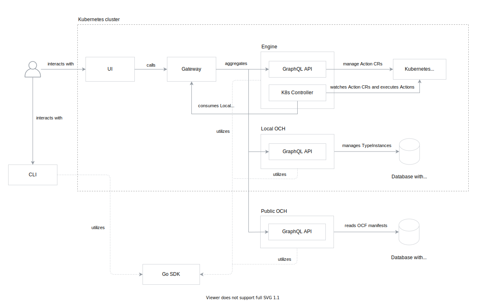

# E2E Architecture

The document describes high-level Capact architecture, all components in the system and interactions between them.

> **NOTE**: This document showcases architecture for Alpha phase. After Alpha stage the document will be updated to describe the target GA architecture. 

## Components

The following diagram visualizes all components in the system:

### OCF

Open Capability Format (OCF) is not a component per-se, but it's also an important part of the system. OCF is a specification of manifests for every entity in the system.
It is stored in a form of multiple JSON Schema files. From the JSON schemas all internal [SDK](#sdk) Go structs are generated.

OCF manifests are stored in [OCH](#och).

### UI

UI is the easy way to manage Actions and consume [OCH](#och) content.

It exposes the following functionalities:
- see available Implementations for a given system, grouped by InterfaceGroups and Interfaces,
- see the available TypeInstances, along with theirs status and metrics,
- render and execute Actions, with advanced rendering mode support.

UI does all HTTP requests to [Gateway](#gateway).

### CLI

CLI is command line tool which makes easier with working the [OCF](#ocf) manifests and Actions.

To read the documentation about CLI tool, see the [`docs`](https://github.com/capactio/capact/tree/main/cmd/cli/docs) subdirectory in the `cmd/cli` directory.

CLI utilizes [SDK](#sdk).

### Gateway

Gateway is a GraphQL reverse proxy. It aggregates multiple remote GraphQL schemas into a single endpoint. It enables UI to have a single destination for all GraphQL operations.

Based on the GraphQL operation, it forwards the query or mutation to a corresponding service:
- [Engine](#engine) - for CRUD operations on Actions,
- Local [OCH](#och) - for create, read, delete operations on TypeInstances,
- Public [OCH](#och) - for read operations for all other manifests except for TypeInstance.

It also runs an additional GraphQL server, which exposes single mutation to change URL for Public [OCH](#och) API aggregated by Gateway.

### Engine

Engine is responsible for validating, rendering and executing Actions. Action describes user intention in platform-agnostic way - which Interface or Implementation to run with a given input parameters and artifacts. For Kubernetes implementation, we use Kubernetes Custom Resources to store Action data.

Engine composes of two modules:
- GraphQL API server, which exposes platform-agnostic API for managing Actions,
- Kubernetes operator, which handles Action validation, rendering and execution based on Action Custom Resources `spec` property.

To resolve Actions, Engine uses GraphQL queries for TypeInstances, Interface and Implementations through Gateway.

Engine utilizes [SDK](#sdk). To execute Actions, it uses Kubernetes Jobs, that executes [Argo](https://github.com/argoproj/argo) workflows.

### OCH

Open Capability Hub (OCH) stores [OCF](#ocf) manifests and exposes API to access and manage them. It uses graph database as a storage for the data.

OCH works in two modes:
- Local OCH exposes GraphQL API for managing TypeInstances (create, read, delete operations),
- Public OCH, which exposes read-only GraphQL API for querying all OCF manifests except TypeInstances.

Every manifest for Public OCH has to be signed with [CLI](#cli). Signed manifests are populated with DB Populator, which populates the graph database directly from a given directory structure.

OCH utilizes [SDK](#sdk).

### SDK

SDK is a Go library with low-level and high-level functions used by [Engine](#engine), [OCH](#och) and [CLI](#cli).

SDK can be used by Users to interact with Capact components in a programmatic way.

## Detailed interaction

The section contains detailed interaction diagrams, to understand how the system works in a higher level of detail.

### Executing Action

On the following diagram, User executes the WordPress install Action using UI.

> **NOTE:** To make the diagram more readable, some details have been omitted, such as User impersonation setup or details about watching built-in Runner status. Also, the Gateway component was excluded. Every operation proxied by Gateway is described with _(via Gateway)_ phrase.

