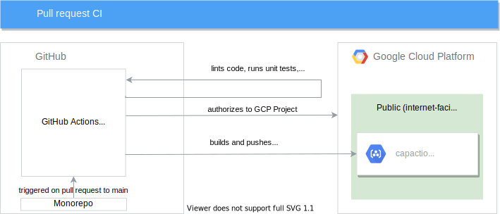

#  Voltron CI and CD

This document describes jobs created to automate the process of testing, building, and deploying newly merged functionality.

##  Table of Contents

<!-- toc -->

- [Overview](#overview)
- [Repository secrets](#repository-secrets)
- [Pipelines](#pipelines)
  * [Pull request](#pull-request)
  * [Master branch](#master-branch)
  * [Recreate a long-running cluster](#recreate-a-long-running-cluster)
    + [Let's encrypt certificates](#lets-encrypt-certificates)
  * [Execute integration tests on a long-running cluster](#execute-integration-tests-on-a-long-running-cluster)
- [Accessing encrypted files on CI](#accessing-encrypted-files-on-ci)
- [Add a new pipeline](#add-a-new-pipeline)

<!-- tocstop -->

##  Overview

For all our CI/CD jobs, we use [GitHub Actions](https://docs.github.com/en/free-pro-team@latest/actions). Our workflows are defined in the [`.github/workflows`](../.github/workflows) directory. All scripts used for the CI/CD purpose are defined in the [`/hack/ci/`](../hack/ci) directory. For example, the [`/hack/ci/setup-env.sh`](../hack/ci/setup-env.sh) file has defined all environment variables used for every pipeline job.

##  Repository secrets

All sensitive data is stored in [GitHub secrets](https://docs.github.com/en/free-pro-team@latest/actions/reference/encrypted-secrets). As a result, we can access them in each workflow executed on our pipeline.

The following secrets are defined:

| Secret name       | Description                                                                                                                                                                                           |
|-------------------|-------------------------------------------------------------------------------------------------------------------------------------------------------------------------------------------------------|
| **GCR_CREDS**     | Holds credentials which allow CI jobs to push Docker images to our GCR. Has all roles that are defined [here](https://cloud.google.com/container-registry/docs/access-control#permissions_and_roles). |
| **GKE_CREDS**     | Holds credentials which allow CI jobs to create and manage the GKE private cluster. Has the `roles/container.admin` role.                                                                             |
| **GIT_CRYPT_KEY** | Holds a symmetric key used to decrypt files encrypted with [git crypt](https://github.com/AGWA/git-crypt).                                                                                            |

##  Pipelines

###  Pull request



The job is defined in the [`pr-build.yaml`](../.github/workflows/pr-build.yaml) file. It runs on pull requests created to the `master` branch.

It tests submitted changes, builds the components' Docker images, and pushes them to GCR using this pattern: `gcr.io/projectvoltron/pr/{service_name}:PR-{pr_number}`.

###  Master branch


The job is defined in the [`.github/workflows/branch-build.yaml`](../.github/workflows/branch-build.yaml) file. It runs on every new commit pushed to the `master` branch but skips execution for files which do not affect the building process, e.g. documentation, OCH content, etc.

It, once again, tests the source code, builds the components' Docker images, and pushes them to GCR using this pattern: `gcr.io/projectvoltron/{service_name}:{first_7_chars_of_commit_sha}`.

If all steps pass, it updates the existing long-running cluster.

###  Recreate a long-running cluster


The job is defined in the [`.github/workflows/recreate_cluster.yaml`](../.github/workflows/recreate_cluster.yaml) file. It is executed on a manual trigger using the [`workflow_dispatch`](https://github.blog/changelog/2020-07-06-github-actions-manual-triggers-with-workflow_dispatch/) event. It uses already existing images available in the [gcr.io/projectvoltron](gcr.io/projectvoltron) registry. As a result, you need to provide a git SHA from which the cluster should be recreated. Optionally, you can override the Docker image version used via the **DOCKER_TAG** parameter.

> **CAUTION:** This job removes the old GKE cluster.

####  Let's encrypt certificates

The `recreate` job checks if the certificate exists in the GCS bucket. If it does, it downloads it and checks if the certificate is still valid. If it's valid, it copies it to a long-running cluster, otherwise the job creates the Let's Encrypt certificates using Cert Manager and backs it up to the dedicated GCS bucket. By doing so, we ensure that we do not hit the quotas defined on the Let's Encrypt side.

###  Execute integration tests on a long-running cluster


The job is defined in the [`.github/workflows/cluster_integration_tests.yaml`](../.github/workflows/cluster_integration_tests.yaml) file. It runs periodically according to cron defined in the job definition. It executes integration tests using the `helm test` command.

##  Accessing encrypted files on CI

The sensitive data that needs to be accessed on a pipeline, such as overrides for passwords, certificates etc., must be stored in the [`hack/ci/sensitive-data`](../hack/ci/sensitive-data) directory. Files in that folder are encrypted using [git crypt](https://github.com/AGWA/git-crypt), which you should install and configure on your local machine. Currently, it works for `*.txt` files put in this directory, but this can be changed in the `.gitattributes` file.

The demo setup is as follows:

```bash
*.txt filter=git-crypt diff=git-crypt
.gitattributes !filter !diff
```

It means that every `*.txt` file in the `hack/ci/sensitive-data` directory is encrypted before being push to a git repository. If you need to encrypt other files in a different directory, you have to create there a `.gittatributes` file with proper rules. Do not forget to add the `.gitattributes !filter !diff` statement as it prevents encryption for the `.gitattributes` file.

To decrypt the data locally, you must either use a symmetric key or add the GPG key. The procedure of decrypting files and working with it in a team is described [here](https://buddy.works/guides/git-crypt#working-in-team-with-git-crypt).

Currently, [`decrypt.yaml`](../.github/workflows/decrypt.yaml) shows how to decrypt a file on CI.

##  Add a new pipeline

To create a new pipeline you must follow the rules of the syntax used by GitHub Actions. The new workflow must be defined in the [`.github/workflows`](../.github/workflows) directory. All scripts for CI/CD purposes must be defined in the [`/hack/ci/`](../hack/ci) directory.

The following steps show how to checkout the code, set up the Go environment, and authorize to GCR and GKE in case they are necessary.

```yaml
    steps:    
      - name: Checkout code
        uses: actions/checkout@v2

      - name: Authorize to GCR
        uses: GoogleCloudPlatform/github-actions/setup-gcloud@master
        with:
          export_default_credentials: true
          service_account_key: ${{ secrets.GCR_CREDS }}
      - name: Authorize to GKE
        uses: GoogleCloudPlatform/github-actions/setup-gcloud@master
        with:
          service_account_key: ${{ secrets.GKE_CREDS }}
          export_default_credentials: true

      - name: Setup env
        run: |
          . ./hack/ci/setup-env.sh

      - name: Setup Go
        uses: actions/setup-go@v2
        with:
          go-version: ${{env.GO_VERSION}}
```
