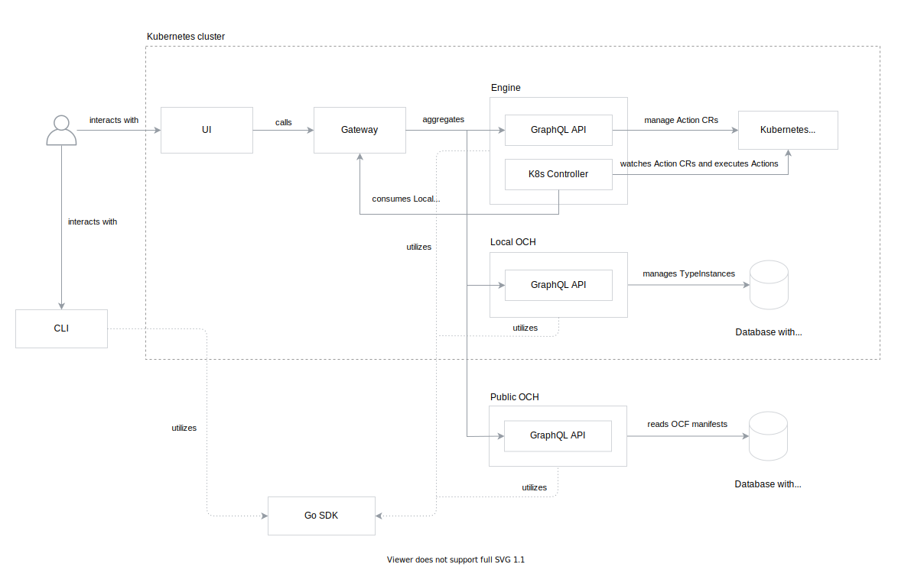

# E2E Architecture

The document describes high-level Voltron architecture, all components in the system and interactions between them.

> **NOTE**: This document showcases architecture for Alpha phase. After Alpha stage the document will be updated to describe the target GA architecture. 

## Components

The following diagram visualizes all components in the system:

To learn about responsibilities for every components, read the subsections.

### UI

### CLI

### Gateway

Gateway is a GraphQL reverse proxy. It aggregates multiple GraphQL APIs into a single endpoint. It enables UI to have a single destination for all GraphQL operations.

Based on the GraphQL operation, it forwards the query or mutation to a corresponding service:
- Engine - for Action CRUD operations
- Local OCH
- Public OCH

### Engine

#### GraphQL API

#### Kubernetes Controller

### OCH

#### Local

#### Public

## Detailed interaction

### Executing Action

On the following diagram, User executes the WordPress install Action using UI.

## TODO
- Describe components
- Remove this section
