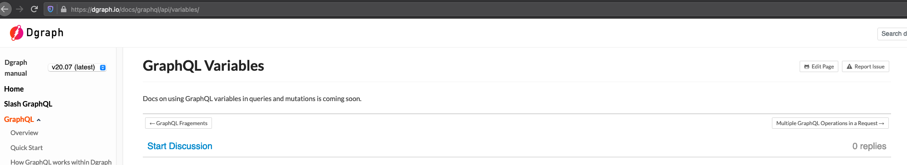

# Dgraph as OCH graph database

### Criteria

Checklist:
-	[ ] Can we use just one graphql schema for storing and querying object
-	[ ] How to expose the GraphQL Playground
-	[ ] Is there an output schema that can be consumed by GraphQL playground
-	[ ] What is under the hood, is it also using [gql-gen](https://github.com/99designs/gqlgen) lib for generating types
-	[ ] How to write custom queries, mutations, scalars, types
-	[ ] Is there some directive for validation (e.g. checking SemVer syntax)
-	[ ] Resources consumption (run 1k queries/mutations)
-	[ ] Check transactions system
-	[ ] Check [type system](https://dgraph.io/docs/query-language/type-system/)
-	[ ] Check go client, execute some queries using Go client and some using GraphQL Playground
-	[ ] Check subscription

## Quick start
-	Start Dgraph GraphQL server

	```bash
	$ docker run -it -p 8080:8080 dgraph/standalone:master
	...
	```
1.	Add a GraphQL Schema

	```bash
	$ curl -X POST localhost:8080/admin/schema --data-binary '@assets/public-och-schema.graphql'
	{"data":{"code":"Success","message":"Done"}}
	```

## Cons
-	some sections are not finished 
-	generates a lot of boilerplate. Each type has own mutations/queries. We can disable that but it is available on master: https://dgraph.io/docs/master/graphql/schema/generate
-	There is no `Any` scalar. How to replace that for **jsonSchema** property?

## Extras
-	Populate database using RDF or JSON. Dgraph as of now supports mutation for two kinds of data: RDF and JSON.
-	Compression is out of the box: https://dgraph.io/docs/graphql/api/requests/#compression. Maybe we can use it at the beginning for cache sync?
-	Maybe use cascade to get implementation: https://dgraph.io/docs/graphql/queries/cascade. Use it to do not return interfaces without implementation.

-	To run with locally saved data:

	```bash
	docker run --rm -it -p 8080:8080 -p 9080:9080 -p 8000:8000 -v ~/dgraph:/dgraph dgraph/standalone:v20.03.0
	```
