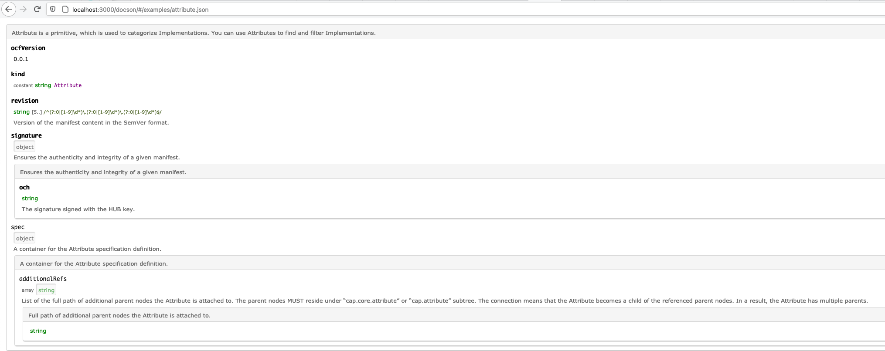

# Generate documentation from JSONSchemas

This document describes the available open-source libraries that are able to generate the documentation for [JSON Schema draft-07](https://json-schema.org/draft-07/json-schema-release-notes.html).

## Motivation

The [OCF entities](../../../ocf-spec/0.0.1/schema) are described using JSON Schemas draft-07. To improve our UX we want to generate documentation for them. In that way, we can maintain a single source of truth and also expose a user-friendly specification documentation.

Desired documentation: https://www.asyncapi.com/docs/specifications/2.0.0

## Investigation

This section contains the result of the testing different libraries that generates documentation from JSON Schemas.

### Adobe `jsonschema2md`

Repository: https://github.com/adobe/jsonschema2md

Last release: v5.0.5 on Mar 20, 2021

Last update: Mar 20, 2021

#### Example
-	Their: https://github.com/adobe/jsonschema2md/tree/main/examples/docs

-	Our: [adobe-jsonschema2md](./adobe-jsonschema2md)

#### Generation

> **NOTE:** Because this tool generated 60+ files I leave only the Implementation entity, just for example.  
 
The [adobe-jsonschema2md](./adobe-jsonschema2md) content was generated by executing this command:

```bash
jsonschema2md -d ocf-spec/0.0.1/schema/ -o docs/investigation/doc-from-json-schema/adobe-jsonschema2md --schema-extension=json --example-format=yaml --skip  typesection -n --schema-out=-
```

#### Pros
-	Supports JSONSchema draft-07.
-	It is actively maintained.
-	Supports the `$ref` out-of-the-box, even if not exposed on HTTP server.

#### Cons
-	Generates 60+ files for our schemas, and we are not able to configure that each schema should be in a single file. As a result, we have files named like `implementation-properties-metadata-allof-1-properties-license-oneof-0-properties-name.md`.
-	Not all files are generated, but we also do not get any error, e.g. for [`interfaces.md`](./adobe-jsonschema2md/interface.md) the `interface-properties-spec.md` was not generated. Needs to be investigated further.
-	It duplicates information, e.g. [`atrribute.md`](./adobe-jsonschema2md/attribute.md) has full definition for the `ocfVersion` type, but we also have [`attribute-properties-ocfversion.md`](./adobe-jsonschema2md/attribute-properties-ocfversion.md) which duplicates this information.
-	The shared metadata is generated as a single `.md` file. But others files refer to `attribute-properties-ocf-metadata.md` instead of `metadata.md`. Needs to be investigated further.  
-	**[minor]** The `title` property needs to be added, otherwise it generates is as `Untitled schema`.

### Wetzel

Repository: https://github.com/CesiumGS/wetzel

Last release: 0.1.0-dev.1.5 on Dec 3, 2020

Last update: Dec 3, 2020

#### Example
-	Their: https://github.com/KhronosGroup/glTF/tree/master/specification/2.0#properties-reference
-	Our: [wetzel](./wetzel)

#### Generation

The [wetzel](./wetzel) content was generated by executing this command:

```bash
wetzel ocf-spec/0.0.1/schema/attribute.json  -l 2 > ./docs/investigation/doc-from-json-schema/wetzel/attribute.md
wetzel ocf-spec/0.0.1/schema/interface.json  -l 2 > ./docs/investigation/doc-from-json-schema/wetzel/interface.md
wetzel ocf-spec/0.0.1/schema/interface-group.json  -l 2 > ./docs/investigation/doc-from-json-schema/wetzel/interface-group.md
wetzel ocf-spec/0.0.1/schema/repo-metadata.json  -l 2 > ./docs/investigation/doc-from-json-schema/wetzel/repo-metadata.md
wetzel ocf-spec/0.0.1/schema/repo-metadata.json  -l 2 > ./docs/investigation/doc-from-json-schema/wetzel/repo-metadata.md
wetzel ocf-spec/0.0.1/schema/type.json  -l 2 > ./docs/investigation/doc-from-json-schema/wetzel/type.md
wetzel ocf-spec/0.0.1/schema/type.json  -l 2 > ./docs/investigation/doc-from-json-schema/wetzel/type.md
wetzel ocf-spec/0.0.1/schema/vendor.json  -l 2 > ./docs/investigation/doc-from-json-schema/wetzel/vendor.md

# implementation not supported, error: Error: Unable to find $ref #/definitions/requireEntity
# wetzel ocf-spec/0.0.1/schema/implementation.json  -l 2 > ./docs/investigation/doc-from-json-schema/wetzel/implementation.md
```

#### Pros
-	Generates single file per JSON Schema.
-	Returns Readable and helpful errors messages.

#### Cons
-	Supports only local `$ref`. Doesn't support `http` refs, or even definition reference: `Error: Unable to find $ref #/definitions/requireEntity`
-	Supports the Draft-3 and Draft-4. We use Draft-7.
-	Supports parsing single schema at time.
-	**[minor]** The `title` property needs to be added, otherwise it generates is as `WETZEL_WARNING: title not defined.xxx`.

### RalfG `jsonschema2md`

Repository: https://github.com/RalfG/jsonschema2md

Last release: v0.1.1 on Aug 31, 2020

Last update: Sep 2, 2020

#### Example
-	Their: https://github.com/RalfG/jsonschema2md/tree/master/examples
-	Our: [ralfg-jsonschema2md](./ralfg-jsonschema2md)

#### Generation

The [ralfg-jsonschema2md](./ralfg-jsonschema2md) content was generated by executing this command:

```bash
jsonschema2md ocf-spec/0.0.1/schema/attribute.json ./docs/investigation/doc-from-json-schema/ralfg-jsonschema2md/attribute.md
jsonschema2md ocf-spec/0.0.1/schema/interface.json ./docs/investigation/doc-from-json-schema/ralfg-jsonschema2md/interface.md
jsonschema2md ocf-spec/0.0.1/schema/interface-group.json ./docs/investigation/doc-from-json-schema/ralfg-jsonschema2md/interface-group.md
jsonschema2md ocf-spec/0.0.1/schema/repo-metadata.json ./docs/investigation/doc-from-json-schema/ralfg-jsonschema2md/repo-metadata.md
jsonschema2md ocf-spec/0.0.1/schema/repo-metadata.json ./docs/investigation/doc-from-json-schema/ralfg-jsonschema2md/repo-metadata.md
jsonschema2md ocf-spec/0.0.1/schema/type.json ./docs/investigation/doc-from-json-schema/ralfg-jsonschema2md/type.md
jsonschema2md ocf-spec/0.0.1/schema/type.json ./docs/investigation/doc-from-json-schema/ralfg-jsonschema2md/type.md
jsonschema2md ocf-spec/0.0.1/schema/vendor.json ./docs/investigation/doc-from-json-schema/ralfg-jsonschema2md/vendor.md
jsonschema2md ocf-spec/0.0.1/schema/implementation.json ./docs/investigation/doc-from-json-schema/ralfg-jsonschema2md/implementation.md
```

#### Pros
-	Generates single file per JSON Schema

#### Cons
-	The generated documentation is really simple. For example, doesn't add information is something is required or not.
-	Doesn't support inlining the `$ref` definition.
-	Supports single schema at time.
-	For implementation the `metadata` property was not resolved properly.

### json-schema-md-doc

Repository: https://github.com/BrianWendt/json-schema-md-doc

Last update: Jan 26, 2021

#### Example
-	Their: https://github.com/BrianWendt/json-schema-md-doc/blob/master/samples/node/schema.md
-	Own: [json-schema-md-doc](./json-schema-md-doc)

#### Cons
-	No CLI.
-	Not user-friendly format.

### Docson

Repository: https://github.com/lbovet/docson

Last release: v2.1.0 on Aug 8, 2018

Last update:  Mar 14, 2020

#### Example
-	Their: https://lbovet.github.io/docson/index.html#/docson/examples/example.json
-	Our: 

#### Cons
-	Package was published 3 years ago.
-	Doesn't support $ref.
-	Supports the Draft-4, we use Draft-7.
-	Doesn't generate `.md` files, serve content in browser. Nodejs server is required.
-	Doesn't have option to see all exposed schemas. You need to use a single URL per schema.

### json-schema-for-humans

Repository: https://github.com/coveooss/json-schema-for-humans

Last release: v0.31.0 on Feb 22, 2021

Last update:  on Feb 22, 2021             

#### Example
-	Their: https://coveooss.github.io/json-schema-for-humans/
-	Our: [json-schema-for-humans](./json-schema-for-humans/schema_doc.html)

#### Generation

```bash
generate-schema-doc ocf-spec/0.0.1/schema/attribute.json
```

#### Cons
-	Supports single schema at time.
-	Doesn't generate .md files, serve content in browser.
-	Doesn't have option to see all exposed schemas. You need to use a single URL per schema.
