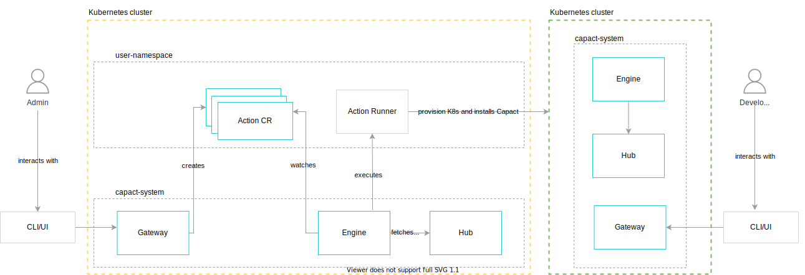

# Multi-cluster support

This document describes possible solutions for supporting scheduling Capact workflows on external Kubernetes clusters.

## Capact manifests definition

This section describes how the multi-cluster can be described in Capact manifests. The idea is to use the already existing `requires` and `additionalInput` sections.

When the Implementation requires `cap.core.type.platform.kubernetes`, the default `cap.core.type.platform.kubernetes` TypeInstance is used. This means that steps are executed on Kubernetes where Capact was installed. To override that, you need to register a new `cap.core.type.platform.kubernetes` TypeInstance which has the `kubeconfig` and inject it to a given Action via [Policy](https://capact.io/docs/next/feature/policies/overview). This information is used by our Argo Renderer which mutates steps to schedule them on a target cluster with provided kubeconfig permissions.

### Use cluster generated in umbrella workflow 

Example of the Implementation manifest that bootstraps Kubernetes cluster and installs PostgreSQL on it:

```yaml
kind: Implementation
metadata:
  displayName: "Boostrap PostgreSQL cluster"
  # ...
spec:
  additionalInput:
    typeInstances:
      kubernetes:
        typeRef:
          path: cap.core.type.platform.kubernets
          revision: 0.1.0
        verbs: [ "get" ]

  # No `requires` section - this workflow doesn't depend on K8s directly.

  action:
    runnerInterface: argo.run
    args:
      workflow:
        entrypoint: postgresql-cluster
        templates:
          - name: postgresql-cluster
            inputs:
              artifacts:
                - name: input-parameters
                - name: kubernetes
                  optional: true
            steps:
              - - name: create-target-cluster
                  capact-when: kubernetes == nil
                  capact-action: k8s.deploy
              - - name: postgresql-install
                  capact-action: postgresql.install
                  capact-policy:
                    rules:
                      - interface:
                          path: postgresql.install
                        oneOf:
                          - implementationConstraints:
                              requires:
                                - path: "cap.core.type.platform.kubernetes"
                            inject:
                              requiredTypeInstances:
                                - artifact: "{{steps.create-target-cluster.outputs.artifacts.kubernetes}}"
```

Capact user or admin can provide already existing Kubernetes cluster via Policy:

```yaml
rules:
  - interface: 
      path: "cap.interface.database.postgresql.bootstrap-cluster"
    oneOf:
      - implementationConstraints: # In first place, find and use an Implementation which:
          path: "cap.implementation.postgresql.bootstrap-cluster"
        inject:
          additionalTypeInstances: # Injects additional TypeInstances for the Implementation
            - name: kubernetes # Name must match one of the parameter defined under `additionalInput.typeInstances` in the Implementation
              id: 0b6dba9a-d111-419d-b236-357cf0e8603a
```

### Use pre-existing (registered) cluster

Example of the Implementation manifest that installs the PostgreSQL on Kubernetes platform:

```yaml
kind: Implementation
metadata:
  # ...
  displayName: Install PostgreSQL database
spec:
  # ...
  requires:
    cap.core.type.platform:
      oneOf:
        - name: kubernetes
          revision: 0.1.0

  action:
    runnerInterface: argo.run
    args:
      workflow:
        entrypoint: postgres-install
        templates:
          - name: postgres-install
            steps:
              - - name: helm-install
                  # Argo renderer mutates the container definition to ensure that it's created on a given target cluster. 
                  # It's done based on injected `cap.core.type.platform.kubernetes` TypeInstance
                  capact-action: helm.install
```

If necessary we can introduce the `capact-target` property which can be used to mark a given step to be executed on a given cluster. Without `capact-target` step is not mutated, so it's executed where Argo was installed:

```yaml
# ...
  requires:
    cap.core.type.platform:
      oneOf:
        - name: kubernetes
          alias: k8s
          revision: 0.1.0

# ...
            steps:
              - - name: helm-install
                  capact-action: helm.install
                  capact-target: k8s # based on alias in requires section 
# ...
```

Capact user or admin can override the default Kubernetes cluster used in Implementation via Policy:

```yaml
rules:
  - interface: 
      path: "cap.interface.database.postgresql.install"
    oneOf:
      - implementationConstraints: # In first place, find and use an Implementation which:
          requires: # has the following Type references defined in the `spec.requires` property:
            - path: "cap.core.type.platform.kubernetes"
        inject:
          requiredTypeInstances: # For such Implementation, inject the following TypeInstance. 
            - id: 9038dcdc-e959-41c4-a690-d8ebf929ac0c
              description: "EU workload cluster"
```

### Consequences

To reduce the boilerplate and support multi-cluster in Capact, the following items need to be resolved:

1. Remove `cap.attribute.containerization.kubernetes.kubeconfig-support` from **attributes**.

2. Merge the `cap.type.containerization.kubernetes.kubeconfig` to `cap.core.type.platform.kubernets` as we don't have the [Type composition](https://capact.io/docs/feature/type-features#type-composition) yet.

3. Allow injecting `cap.core.type.platform.kubernets` via Policy. We already use such approach for AWS and GCP credentials. 

4. Add option to use `inject.requiredTypeInstances` via artifact name in Workflow Policy. This will solve https://github.com/capactio/capact/issues/538 as we will do that via Policy instead.

6. Solve [Support setting relations for optional TypeInstances in workflows](https://github.com/capactio/capact/issues/537) issue, but also take into account TypeInstances from the `requires` section.

## Possible implementations

This section describes possible options on how to implement logic for syntax described in the [Capact manifests definition](#capact-manifests-definition) section.

### Kubernetes TypeInstance

Currently, we inject the `cap.type.containerization.kubernetes.kubeconfig`. This simply can be changed to `cap.core.type.platform.kubernetes`.

In this scenario, we only inject a given TypeInstance. It's up to Content Developer to consume it and use.

**Pros:**
- Capact only provides an option to manage and pass a given Kubernetes TypeInstance to an Action. It's simple and generic, as the Content Developer is in charge of using a given kubeconfig.

**Cons:**
- All Capact Runners need to be aware about injected `kubernetes` TypeInstance. Currently, only Helm Runner can consume it,
- Content Developer needs to handle the `kubernetes` TypeInstance by themself. For example, use it to all executed `kubectl` commands,
- It's up to Content Developer to create proper relations between TypeInstance.

#### Consequences

All consequences described [here](#consequences) applies.

### Multi-cluster Workflows in Argo

Argo Workflows wants to support the [multi-cluster Workflows](https://github.com/argoproj/argo-workflows/issues/3523). There is a [draft PR](https://github.com/argoproj/argo-workflows/pull/6804) but without any information when this functionality will be merged.

The proposed solution adds `cluster` and `namespace` properties for container template.

```yaml
apiVersion: argoproj.io/v1alpha1
kind: Workflow
metadata:
  name: multi-cluster
  namespace: local
spec:
  entrypoint: main
  serviceAccountName: workflow
  templates:
    - name: main
      cluster: cluster-1            # easy to add during render process
      namespace: remote             # easy to add during render process
      container:
        image: docker/whalesay
```

This can be added during the render process by our [Argo Renderer](https://github.com/capactio/capact/tree/main/pkg/sdk/renderer/argo).

**Pros:**
- Creates workload directly on target cluster.
- No need to install agents on target cluster.
- Uses dedicated ServiceAccount to create and managed created resources on target cluster.
- Capact Runners don't know that they were executed on different cluster.

**Cons:**
- Logs cannot be accessed from the user interface.
- Pod dependencies (config maps and secrets) and dependents (services and ingresses) are not copied to target clusters.

**Unfortunately, as this is still a work in progress, we cannot relay on it. It can be revisited in the future.**

### Virtual-kubelet-based approaches 

[Virtual Kubelet (VK)](https://github.com/virtual-kubelet/virtual-kubelet) is a "Kubernetes kubelet implementation that masquerades as a kubelet to connect Kubernetes to other APIs".
Admiralty, Tensile-kube, and Liqo, adopt this approach. 

#### Admiralty

Admiralty is a multi-cluster scheduler. They have a [blog post](https://admiralty.io/blog/2019/01/17/running-argo-workflows-across-multiple-kubernetes-clusters) about integration with Argo Workflows. Unfortunately, the tutorial is out-dated. You can no longer enforce placement with the `multicluster.admiralty.io/clustername` annotation, as they replaced that with a more idiomatic node selector.

To try Admiralty, follow the [Admiralty with Capact](./admiralty.md) tutorial.

The Admiralty needs to be installed both on the "control plane" and "target" Kubernetes clusters. To make it easier, we have to have a dedicate Action to register an external cluster. Such approach is good also for the future as we can easily swap out the Admiralty with other project as the setup is hidden from the user point of view.

Additionally, we need to adjust the Argo renderer. When renderer sees the required `cap.core.type.platform.kubernetes`, it should add `multicluster.admiralty.io/elect: ""` annotation and **nodeSelector** to all containers definitions. To simplify the rendering, we can always add it. The default `cap.core.type.platform.kubernetes` TypeInstance will refer to Targets which targets local cluster:

```yaml
apiVersion: multicluster.admiralty.io/v1alpha1
kind: Target
metadata:
  name: this-cluster
  namespace: namespace-a
spec:
  self: true
```

**Cons:**
- Needs to be installed on target cluster.
- Last update was on 21 Sep 2021.
- It's easy to schedule pod in **all** registered target clusters if you specify only `multicluster.admiralty.io/elect: ""` without **nodeSelector**. In our case, it can be problematic.
- Manifests in Helm chart don't have specified the CPU and memory requests and limits. This can be easily solved.
- Uses old Kubernetes manifest versions, which generates such warnings:
  - `policy/v1beta1 PodDisruptionBudget is deprecated in v1.21+, unavailable in v1.25+; use policy/v1 PodDisruptionBudget`
  - `apiextensions.k8s.io/v1beta1 CustomResourceDefinition is deprecated in v1.16+, unavailable in v1.22+; use apiextensions.k8s.io/v1 CustomResourceDefinition`

**Pros:**
- Steps defined by Content Developer don't know that they were executed on different cluster.
- As it uses the proxy Pod concept, all functionality e.g. fetching logs, checking Pod status etc. can be executed on the main cluster and not only on the target cluster.
- "If the Admiralty agent in the management cluster or the management cluster itself breaks or loses connectivity with workload clusters, existing pods and services in the workload clusters continue to run and serve requests—if pods are evicted in the meantime, they're even recreated locally by PodChaperons—so your applications stay available."
- Pod dependencies (config maps and secrets) and dependents (services and ingresses) "follow" delegate pods, i.e., they are copied as needed to target clusters.

#### Consequences

All consequences described [here](#consequences) applies. Additionally:

- Install Admiralty as a part of the Capact component. 
- Create dedicated Action to register an external cluster.
- Adjust the Argo render logic to add proper annotations and node selectors when `cap.core.type.platform.kubernetes` is specified.
- Add necessary properties to the `cap.core.type.platform.kubernetes` Type, so during render process we know which label to use for node selector.

### Capact creates Capact

Instead of adding support for the multi-cluster in Capact, we can create a dedicated Capact Action to create a new Kubernetes clusters with Capact installed on it.

In that approach, we have:
- "Capact control plane" for bootstrapping other Capact clusters. All created clusters are described via TypeInstance. This can be visible in UI where admin can browser all provisioned Capact clusters (TypeInstances) and execute other Actions against those instances. For example, upgrade Capact cluster or destroy it.
- "Capact workload" which is directly use by a developer. Here the proper workloads are created, e.g. GitLab is installed and managed. It provides a nice separation. This cluster can have a specific Global Policy and specific manifests enabled in Hub.



This is the easiest way and doesn't require any new functionality to be implemented or changed in Capact. For now, we can also skip introducing changes described [here](#consequences).

#### Consequences

1. **(optionally)** Solves issues described in [consequences](#consequences) subsection of **Capact manifests definition**.
2. Create a dedicated Action (Interface and Implementation) that provision Kubernetes cluster and installs Capact on it. If an already existing Kubernetes cluster is not specified, workflow creates a new Kubernetes cluster. Includes:
   - Action to bootstrap Kubernetes cluster.
   - Action to install Capact on a given Kubernetes cluster. When the first point will be skipped, we need to adjust the Helm Runner interface.

   > **NOTE:** consider using the Capact CLI in Capact installation manifests.
