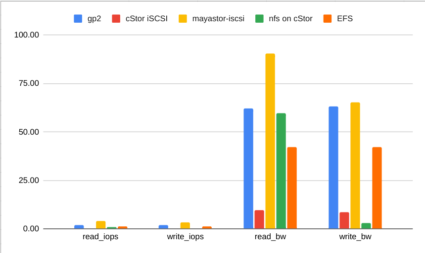

# OpenEBS as a main storage

This document summarizes investigation of [OpenEBS](https://openebs.io/) as a main storage solution.

## Prerequisites

To use OpenEBS worker nodes require iSCSI initiator tools. On Linux AMI the required package is `iscsi-initiator-utils`.
In case of using MayaStor, also setting number of Hugepages to 512 is required.

```bash
yum install iscsi-initiator-utils -y
echo vm.nr_hugepages = 512 | sudo tee -a /etc/sysctl.conf
```

In case of changing Hugepages, node or Kubelet restart is required.

## OpenEBS

The OpenEBS data plane consists of many components. Many of them are created for the same reason.
Many components are in alpha or beta stage.

The following solutions where tested and compared:

* OpenEBS cStor
* OpenEBS MayaStor
* NFS on OpenEBS cStor

For cStor and MayaStore, it was tested if a created volume is available from multiple zones.
For NFS on cStor, it was tested if a volume can be accessed by multiple pods.

### Installation

* [OpenEBS control plane](https://docs.openebs.io/docs/next/installation.html)
* [cStor-operators](https://github.com/openebs/cstor-operators/blob/master/docs/quick.md)
* [MayaStore](https://mayastor.gitbook.io/introduction/quickstart/deploy-mayastor)
* NFS - any server, just set StorageClass to cStor

### Local Volumes

Local Volumes as the name suggests don't offer replication and multi zone support. The biggest advantage of Local Volume is performance.
It uses local disk and is recommended to be used by application which are handling replication by itself. This means that it's a storage for databases.

OpenEBS offers several options for Local Volumes:

* `hostPath` based
* Block based
* LVM Based
* ZFS based

Currently, each option is installed separately. There are plans to merge all these implementations into one project.

### Jiva

Jiva is a fork of Rancher Longhorn. It's a deprecated solution. It's the easiest one to configure and seems to be still maintained. I didn't check it though.

### OpenEBS cStor

It allows creating Persistent Volumes which can be replicated between multiple nodes and availability zones.
Replication is synchronous which means that there may be performance penalty when network is slow.

For HA purposes it's recommended to create pool of at least of 3 nodes. If one node goes down, Volumes will still be accessible. 
In case of node lost, re-adding new node to the pool requires a manual intervention. In the docs they claim that the process can be automated, but I've asked on Slack and couldn't get confirmation how it should work exactly.

Documentation for cStor is not very good. Sine OpenEBS version 2, it is recommended to use [cStor-operators](https://github.com/openebs/cstor-operators) to deploy and manage cStor but main documentation still shows examples for the old method.

### MayaStor

MayaStor is the newest member of OpenEBS family. The main advantage of it is performance. It's much faster than Jiva and even cStor. 
Unfortunately, the documentation for it is really bad. There is only quick start guide showing how to configure it. There are no docs about day 2 operations.

MayaStor is still in beta stage. It also lacks many features. For example even if it gives HA for volumes, it doesn't provide a multipath access.
This means that Pod is connecting to one replica. When that replica is lost, Pod will lose access to the Volume. 

MayaStor also doesn't support Snapshots. This means that for backups we would need to use Restic.

When testing MayaStor, one node with replica was removed. After that I was not able to remove the Volume and PersistentVolumeClaim. Clearly it's not stable enough for production usage.

## Performance

I did simple performance test of several storage options. I've used [kubestr](https://github.com/kastenhq/kubestr), which under the hood uses [aio](https://github.com/axboe/fio/).

The following storage options were tested:

* EBS
* OpenEBS cStor
* OpenEBS MayaStor
* NFS on OpenEBS cStor
* EFS

Speed is in MB/s.

| test name   | args                                               | gp2   | cStor | MayaStore | NFS   | EFS   |
| ----------- | -------------------------------------------------- | ----- | ----- | --------- | ----- | ----- |
| read_iops   | blocksize=4K filesize=2G iodepth=64 rw=randread    | 1.97  | 0.30  | 4.18      | 1.00  | 1.32  |
| write_iops  | blocksize=4K filesize=2G iodepth=64 rw=randwrite   | 1.88  | 0.27  | 3.19      | 0.10  | 1.32  |
| read_bw     | blocksize=128K filesize=2G iodepth=64 rw=randread  | 62.11 | 9.68  | 90.68     | 59.76 | 42.12 |
| write_bw    | blocksize=128k filesize=2G iodepth=64 rw=randwrite | 63.13 | 8.45  | 65.31     | 3.03  | 42.02 |



These tests would require some more investigations, but it's clear that cStor performance is the worst here. MayaStore achieves the same performance as EBS drives which is very promising.

## Backup and Restore

There is a [dedicated plugin](https://github.com/openebs/velero-plugin) for OpenEBS. It works only with cStor though. It uses snapshots for Persistent Volumes backup. In case of MayaStore or other we would need to use Restic together with Velero.

Running backup and restore in general worked ok and was quite fast. I had an issue when tried to restore Jira twice to different namespaces. It failed because of duplicated PV names. There were some leftovers after this action. Some cloned volumes were still running in the cluster.

## Local development

MayaStor simply doesn't work on kind. It's written in the docs.

cStor also doesn't work because of issues with running iSCSI initiator.  According to Docker team it [is](https://www.docker.com/blog/road-to-containing-iscsi/) possible to run initiator in the container, but it requires configuring it on the host and is quite invasive. There were also issues with the Node Disk Manager, but there is a workaround for it. It requires creating a file disk and exposing it via /dev/loop. This also requires modifying exclude filter in NDM.

The only option is to use one of Local Volume providers like in Backup and Restore investigation.

## Costs

There are two options for deploying OpenEBS. In both cases additional storage is required. At least 3 volumes in separate availability zones.
For better availability on each node we may create Raid volumes from 3 EBS. In total, it will require 9 volumes.

### Co-hosting on worker nodes

There are no immediate additional costs. OpenEBS deploys quite a few new PODs. This may require bigger nodes.

### Dedicated nodes for storage

To achieve full HA at least 3 nodes are required in separate availability zones.

## Conclusions

OpenEBS is a project which seems to be in a process of transition. Currently, it has so many options that it's not clear which one should be used.
Documentation is messy. It contains information for old projects and points to GitHub for the latest docs. 
Many projects are in alpha, beta stages.

The most feature rich solution cStor is the slowest. Documentation is recommending to use cstor-operators for installing it, but this project is in beta stage.

From the other hand, the community is very friendly and fast to answer questions on Slack. Although I didn't get clear answer for my last question.
