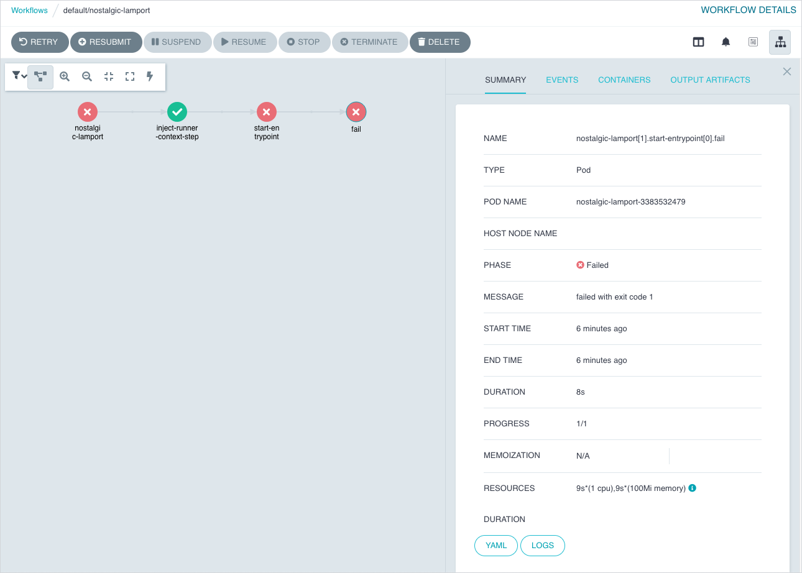

# Basic diagnostics

Here you can find the list of basic diagnostic actions that may help you look for bug causes.

## Table of contents

<!-- toc -->

- [Basic diagnostics](#basic-diagnostics)
  - [Table of contents](#table-of-contents)
  - [Engine](#engine)
    - [Engine health](#engine-health)
    - [Engine logs](#engine-logs)
    - [Checking Action status](#checking-action-status)
    - [Checking Action status message](#checking-action-status-message)
    - [Checking rendered Action workflow](#checking-rendered-action-workflow)
    - [Checking Action execution status](#checking-action-execution-status)
    - [Checking cluster Policy](#checking-cluster-policy)
  - [Gateway](#gateway)
    - [Gateway health](#gateway-health)
    - [Gateway logs](#gateway-logs)
  - [Public OCH](#public-och)
    - [Public OCH health](#public-och-health)
    - [Public OCH logs](#public-och-logs)
    - [OCH Populator logs](#och-populator-logs)
    - [Checking if Public OCH is populated](#checking-if-public-och-is-populated)
  - [Local OCH](#local-och)
    - [Local OCH health](#local-och-health)
    - [Local OCH logs](#local-och-logs)
    - [Checking if TypeInstance exists](#checking-if-typeinstance-exists)
  - [Pod restart](#pod-restart)

<!-- tocstop -->

## Engine 

This section describes [Engine](../architecture/e2e-architecture.md#engine) related diagnostic.

### Engine health

To check if the Engine Pods are in the `Running` state, run:

```bash
kubectl get pod -n capact-system -l app.kubernetes.io/name=engine
```

All the containers from Pods should be in the `Running` status. Restarts number higher than 1 may also indicate problems, e.g. not enough resource, lack of permissions, network timeouts etc.

### Engine logs

If the Engine is [healthy](#engine-health), you should be able to track any bug by checking the logs. To check the logs, run:

```bash
kubectl logs -n capact-system -l app.kubernetes.io/name=engine -c engine
```

To check the logs since a given time, use the `--since-time` flag, for example:

```bash
--since-time=2020-03-30T10:02:08Z
```

### Checking Action status

To check the Action status, run:

```bash
kubectl get actions.core.capact.io ${ACTION_NAME} -n {ACTION_NAMESPACE} -ojsonpath="{.status}"
```

### Checking Action status message

To check the Action status message, run:

```bash
kubectl get actions.core.capact.io ${ACTION_NAME} -n {ACTION_NAMESPACE} -ojsonpath="{.status.message}"
```

### Checking rendered Action workflow

To check the rendered Action workflow before execution, run:

```bash
kubectl get actions.core.capact.io ${ACTION_NAME} -n {ACTION_NAMESPACE} -ojsonpath='{.status.rendering.action.args.workflow}'
```

> **NOTE**: To display it in a more readable format, you can pipe it to [jq](https://stedolan.github.io/jq/download/).

### Checking Action execution status

An Action is executed via Argo Workflows. To check the execution status you can use either Argo CLI or Argo UI:  

- Using command line. 
  
  Install the latest [stable Argo CLI for version v2.x.x](https://github.com/argoproj/argo-workflows/releases), and run:

  ```bash
  argo get {ACTION_NAME} -n {ACTION_NAMESPACE}
  ```

- Using browser.

  By default, the Argo UI is not exposed publicly. You need to port-forward the Service to your local machine: 
  
  ```bash
  kubectl -n capact-system port-forward svc/argo-server 2746
  ```

  Navigate to [http://localhost:2746](http://localhost:2746) to open Argo UI. Argo Workflow has the same name as the executed Action.
  
  

### Checking cluster Policy

To check the cluster Policy definition, run:

```bash
kubectl get cm -n capact-system capact-engine-cluster-policy -oyaml
```

## Gateway

This section describes [Gateway](../architecture/e2e-architecture.md#gateway) related diagnostic.

### Gateway health

To check if the Gateway Pods are in the `Running` state, run:

```bash
kubectl get po -n capact-system -l app.kubernetes.io/name=gateway
```

All the containers from Pods should be in the `Running` status. Restarts number higher than 1 may also indicate problems, e.g. not enough resource, lack of permissions, network timeouts etc.

### Gateway logs

If the Gateway is [healthy](#gateway-health), you should be able to track any bug by checking the logs. To check the logs, run:

```bash
kubectl logs -n capact-system -l app.kubernetes.io/name=gateway -c gateway
```

To check the logs since a given time, use the `--since-time` flag, for example:

```bash
--since-time=2020-03-30T10:02:08Z
```

## Public OCH

This section describes Public [OCH](../architecture/e2e-architecture.md#och) related diagnostic.

### Public OCH health

To check if the Public OCH Pods are in the `Running` state, run:

```bash
kubectl get po -n capact-system -l app.kubernetes.io/name=och-public
```

All the containers from Pods should be in the `Running` status. Restarts number higher than 1 may also indicate problems, e.g. not enough resource, lack of permissions, network timeouts etc.

### Public OCH logs

If the Public OCH is [healthy](#public-och-health), you should be able to track any bug by checking the logs. To check the logs, run:

```bash
kubectl logs -n capact-system -l app.kubernetes.io/name=och-public -c och-public
```

To check the logs since a given time, use the `--since-time` flag, for example:

```bash
--since-time=2020-03-30T10:02:08Z
```

### OCH Populator logs

If the Public OCH is [healthy](#public-och-health), you should be able to track any bug by checking the logs. To check the logs, run:

```bash
kubectl logs -n capact-system -l app.kubernetes.io/name=och-public -c och-public-populator
```

To check the logs since a given time, use the `--since-time` flag, for example:

```bash
--since-time=2020-03-30T10:02:08Z
```

### Checking if Public OCH is populated 

- Check if [OCH Populator logs](#och-populator-logs) contain a message similar to: `{"level":"info","ts":1620895282.3582015,"caller":"register/ocf_manifests.go:107","msg":"Populated new data","duration (seconds)":235.525841306}`. It means that manifests were populated successfully. If you get an error similar to: `error: container och-public-populator is not valid for pod capact-och-public-84cc74bc66-pmkhp` it means that the Public OCH Populator is disabled. To enable it, run:

  ```bash
  helm repo add capactio https://storage.googleapis.com/capactio-awesome-charts
  helm upgrade capact capactio/capact -n capact-system --reuse-values --set och-public.populator.enabled=true
  ```

- Check if manifests can be fetched from the Public OCH. Install the latest [stable Capact CLI](https://github.com/capactio/capact/releases), and run:

  ```bash
  capact login # If not logged yet.
  capact hub interfaces search
  ```

  Successful response, should look similar to:
  
  ```bash
                             PATH                             LATEST REVISION                           IMPLEMENTATIONS
  +---------------------------------------------------------+-----------------+-----------------------------------------------------------------+
    cap.interface.analytics.elasticsearch.install             0.1.0             cap.implementation.elastic.elasticsearch.install
                                                                                cap.implementation.aws.elasticsearch.provision
  +---------------------------------------------------------+-----------------+-----------------------------------------------------------------+
    cap.interface.atlassian.stack.install                     0.1.0             cap.implementation.atlassian.stack.install
                                                                                cap.implementation.atlassian.stack.install-parallel
  +---------------------------------------------------------+-----------------+-----------------------------------------------------------------+
    cap.interface.automation.concourse.change-db-password     0.1.0             cap.implementation.concourse.concourse.change-db-password
  +---------------------------------------------------------+-----------------+-----------------------------------------------------------------+
  ...
  ```

- Check if manifest source is correct, run:

  ```bash
  kubectl -n capact-system get deploy capact-och-public -o=jsonpath='{$.spec.template.spec.containers[?(@.name=="och-public-populator")].env[?(@.name=="MANIFESTS_PATH")].value}'
  ```
  
  Check the [go-getter](https://github.com/hashicorp/go-getter#url-format) project to understand URL format.   

## Local OCH

This section describes Local [OCH](../architecture/e2e-architecture.md#och) related diagnostic.

### Local OCH health

To check if the Local OCH Pods are in the `Running` state, run:

```bash
kubectl get po -n capact-system -l app.kubernetes.io/name=och-local
```

All the containers from Pods should be in the `Running` status. Restarts number higher than 1 may also indicate problems, e.g. not enough resource, lack of permissions, network timeouts etc.

### Local OCH logs

If the Local OCH is [healthy](#local-och-health), you should be able to track any bug by checking the logs. To check the logs, run:

```bash
kubectl logs -n capact-system -l app.kubernetes.io/name=och-local -c och-local
```

To check the logs since a given time, use the `--since-time` flag, for example:

```bash
--since-time=2020-03-30T10:02:08Z
```

### Checking if TypeInstance exists

To check if TypeInstance exists. Install the latest [stable Capact CLI](https://github.com/capactio/capact/releases), and run:
                               
```bash
capact login # If not logged yet.
capact typeinstance get {TYPE_INSTANCE_ID}
```

Successful response, should look similar to:

```bash
            TYPE INSTANCE ID                          TYPE                                 USES                                  USED BY                  REVISION
+--------------------------------------+---------------------------------+---------------------------------------+--------------------------------------+----------+
  d9975239-6483-444b-b7de-b9f5a47a710d   cap.type.helm.chart.release        ——                                      ——                                           1
+--------------------------------------+---------------------------------+---------------------------------------+--------------------------------------+----------+
```
 
## Pod restart

When Pods are unhealthy, or if the operation processing is stuck, you can restart the Pod using this command:

```
kubectl delete po -n capact-system -l app.kubernetes.io/name={COMPONENT_NAME}
```
