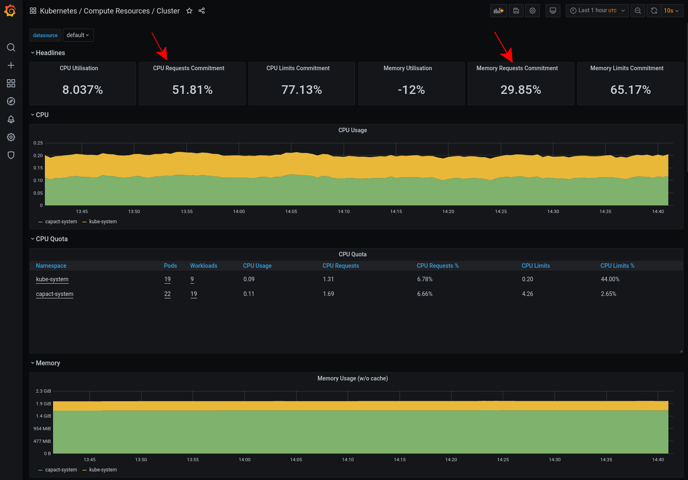
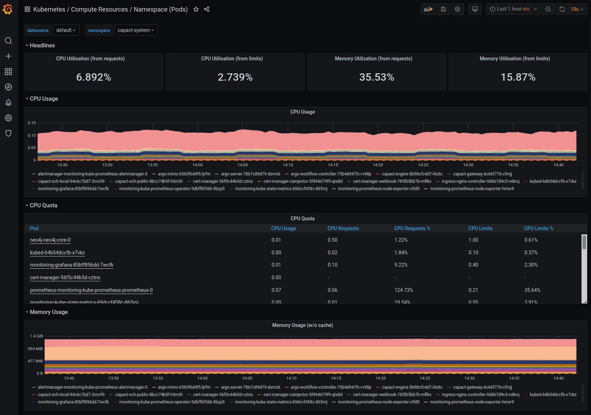
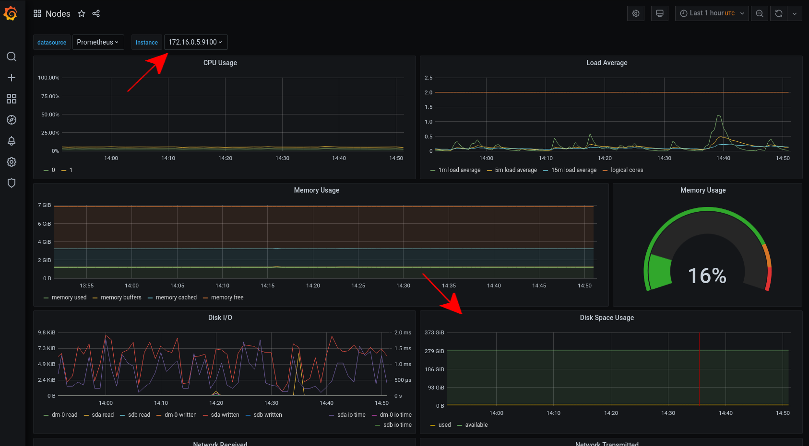

# Capact metrics

This document shows how to check metrics and dashboards of Capact components.

## Connecting to Grafana

1. Get the credentials to log in Grafana:
    ```bash
    # get the Grafana username
    kubectl -n capact-system get secrets monitoring-grafana -ojsonpath="{.data.admin-user}" | base64 -d

    # get the Grafana password
    kubectl -n capact-system get secrets monitoring-grafana -ojsonpath="{.data.admin-password}" | base64 -d
    ```

1. Set up port-forwarding to Grafana:
    ```bash
    kubectl -n capact-system port-forward svc/monitoring-grafana 3000:80
    ```

1. Open [http://localhost:3000](http://localhost:3000) and log in using the credentials from the previous step.

    > **NOTE:** If you use a headless bastion host to get access to the Kubernetes API server, then you can use the following command to setup SSH tunneling to the port-forwarded Grafana service:
    > ```bash
    > ssh -i <bashion-ssh-key> -L 127.0.0.1:3000:127.0.0.1:3000 ubuntu@<bastion-ip>
    > ```
    > This lets you open [http://localhost:3000](http://localhost:3000) on your machine.

## Dashboards

Grafana is pre-configured with dashboards showing many Kubernetes-related metrics.

To see if the Kubernetes cluster has enough capacity, open the **Kubernetes / Computer Resources / Cluster** dashboard. Check that the cluster has enough CPU and memory resources, by looking at the CPU and memory requests commitments. If the value gets near 100%, the cluster might have problem with scheduling new pods or aplications might experience longer downtimes, e.g. in the case of a node failure.



You can also check the **Kubernetes / Compute Resources / Namespace (Pods)** dashboard and look at the Namespaces with the applications, to see the actual resource consumption of the application Pods and compare it with the request and limit quotas. If the usage is constantly above the request quota, then it might be a good idea to increase the request value.



To check the disk space, open the **Nodes** dashboard and look at the **Disk Space Usage** graph for each instance.


