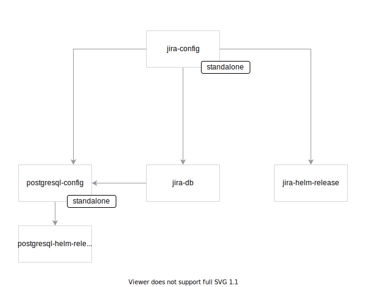
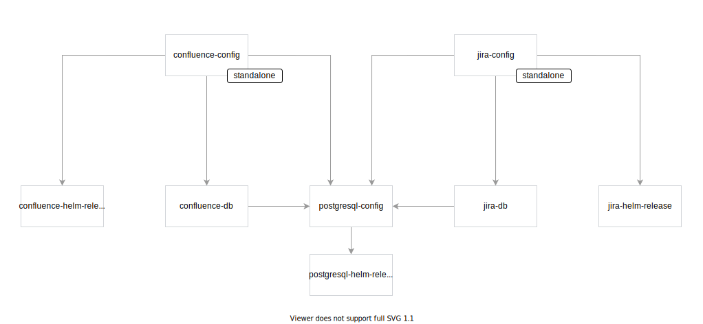

# Action Rollback

Created on 2020-12-09 by Paweł Kosiec ([@pkosiec](https://github.com/pkosiec/))

## Overview

<!-- toc -->

- [Motivation](#motivation)
  * [Goal](#goal)
  * [Non-goal](#non-goal)
- [Remarks](#remarks)
- [Proposal](#proposal)
  * [Triggering rollback action](#triggering-rollback-action)
    + [High-level scenario](#high-level-scenario)
    + [Low-level scenario](#low-level-scenario)
  * [Changes in TypeInstance manifest](#changes-in-typeinstance-manifest)
  * [Changes in Local OCH API](#changes-in-local-och-api)
  * [Changes in Implementation manifest](#changes-in-implementation-manifest)
  * [Changes in Engine](#changes-in-engine)
    + [New `Rollback` Custom Resource](#new-rollback-custom-resource)
    + [Rollback controller in Engine Controller Manager](#rollback-controller-in-engine-controller-manager)
    + [New GraphQL API operations for Rollback](#new-graphql-api-operations-for-rollback)
  * [Example E2E flows](#example-e2e-flows)
    + [Detailed example of Jira installation and rollback](#detailed-example-of-jira-installation-and-rollback)
    + [Rollback of TypeInstance which become dependency](#rollback-of-typeinstance-which-become-dependency)
    + [Rollback of standalone dependency](#rollback-of-standalone-dependency)
    + [Rollback of shared dependency](#rollback-of-shared-dependency)
    + [Rollback to previous revision of updated TypeInstance](#rollback-to-previous-revision-of-updated-typeinstance)
    + [Deleting updated TypeInstance - Rollback with "delete" strategy](#deleting-updated-typeinstance---rollback-with-delete-strategy)
  * [Rejected ideas](#rejected-ideas)
    + [Rollback defined as a separate Implementation manifest](#rollback-defined-as-a-separate-implementation-manifest)
- [Consequences](#consequences)

<!-- tocstop -->

## Motivation

Voltron makes it easy to execute arbitrary Actions in a form of Argo workflows, which can modify cluster state, run
external workloads and output TypeInstances. However, a User should be able to rollback any run Action. For example, to
have a complete application lifecycle implemented using Workflow, there should be an ability to uninstall Application.

### Goal

The proposed solution should enable User to rollback any run Action, reverting any changes caused by run Action, which
are:

- cleaning up cluster resources created by a given Action, as well as reverting any changes done to any system,
- removing created TypeInstances (output TypeInstances from Interfaces and additional output TypeInstances from
  Implementations).

### Non-goal

- Updating TypeInstances in workflow
- TypeInstance revision bump strategy

## Remarks

- Every state change (regardless it is cluster state, state of external system, etc.) must be represented by a proper
  TypeInstance CRUD operation.

- Rollback of a workflow has to be performed with steps in a proper order. For example, uninstall Action should perform
  the uninstall steps in reverse order of the Action install. In general, rollback should follow the reverse directions
  of directional edges in the dependency graph, starting from nodes without descendants to oldest ancestor.

- Rollback is an Implementation-specific Action.

  **Example**

    1. User runs Action `cap.interface.postgresql.install`, which installs PostgreSQL.
    1. Engine picks Implementation that installs PostgreSQL via Helm chart. PostgreSQL is installed on the cluster.
    1. User runs rollback for given Action.
    1. Engine has to use dedicated rollback Action for PostgreSQL installation, which has been installed via Helm chart.
       Engine cannot use rollback for different Implementation,
       e.g. `cap.implementation.gcp.cloudsql.postgresql.install`.

- Rollback should take an input TypeInstance and process all the TypeInstance dependency subtree, to delete unused dependencies.

- A given TypeInstance cannot be removed, if it is a dependency for other TypeInstances (it has ancestors).

- TypeInstance `typeRef` cannot be updated keeping the same TypeInstance ID. In order to "upgrade" referenced Type for a given TypeInstance, Content Creator or User has to create new TypeInstance.

## Proposal

### Triggering rollback action

The rollback action is always triggered by User. User triggers it in the following way:

> **NOTE**: This paragraph is based on "delete" rollback strategy. To see how it behaves during TypeInstance downgrade, see the [Example E2E flows](#example-e2e-flows) paragraph. 

#### High-level scenario

1. User navigates to the TypeInstance tree view.
1. User selects a given TypeInstance.
    - If the TypeInstance is not `standalone`, the "Delete" button is disabled.
    - If the TypeInstance is a dependency for at least one different TypeInstance, the "Delete" button is disabled.
1. User clicks the "Delete" button for a given TypeInstance.
1. A new Rollback Action workflow is created.
1. Engine renders complete Rollback workflow.
1. User approves rollback workflow.
1. The TypeInstance is removed with all unused and not `standalone` dependencies.

#### Low-level scenario

1. User navigates to the TypeInstance tree view.
1. UI calls Local OCH to get all TypeInstances.
1. UI renders TypeInstances.
1. User selects a given TypeInstance.

- If the TypeInstance has `standalone: false` property set, the "Delete" button is disabled.
- If the TypeInstance has at least one ancestor (defined in the `ancestors` property), the "Delete" button is disabled.

1. User clicks the "Delete" button for a given TypeInstance.
1. UI calls Engine GraphQL API to create Rollback Custom Resource via `createRollback` GraphQL mutation.
   
   - The given TypeInstance is passed as an input.
   - The "delete" rollback strategy is picked. 

1. Engine renders the rollback workflow.

    - Engine fetches details for a given TypeInstance with ancestors and descendants.
    - Based on the `actionRollbackRef` property for every TypeInstance in the subtree, Engine renders full workflow to delete the TypeInstance and all dependent unused TypeInstances.
   
   To learn the details, read the [Rollback controller in Engine Controller Manager](#rollback-controller-in-engine-controller-manager) paragraph.
   
1. User approves the rollback workflow. UI calls Engine GraphQL API to set `run: true` for the Rollback operation.   
1. The rollback workflow is run.
   
   - A cleanup is performed according to action rollback definition, specified by Content Developer of a given Action.
   - As a part of the workflow, the given TypeInstance is deleted along all unused dependencies. All TypeInstances with `standalone: true` property are kept.

### Changes in TypeInstance manifest

There are three changes in TypeInstance manifest. See the following example with commented fields:

```yaml
ocfVersion: 0.0.1
revision: 0.0.1 # Full TypeInstance history is needed for TypeInstance upgrade rollback scenarios 
kind: TypeInstance
metadata:
  id: 363056d5-e1a0-4ce5-941d-1dc4d1fe63d0
spec:
  rollbackActionRef: # specifies an action which created/modified a given TypeInstance
    path: cap.implementation.atlassian.jira.install
    revision: 0.1.0
  standalone: true # specifies if the TypeInstance was created with a separate Action
```

**`revision`**

To enable User to rollback TypeInstance to previous version or `n` versions back in time, all historical revisions for a given TypeInstances must be stored.
For naming consistency, the `resourceVersion` could be renamed to `revision`.

> **NOTE:** The idea how to update the TypeInstance revision is out of scope of this proposal. Here are two ideas:
> - update automatically every TypeInstance update. The downside is that the SemVer won't be followed.
> - Force Content Developer to specify which type of TypeInstance update is done in a given workflow (e.g. whether it is a major, minor, or patch). User needs to provide revision during manual TypeInstance creation/update.
> - bring TypeInstance version history, keeping `resourceVersion` naming.

**`spec.rollbackActionRef`**

```yaml
spec:
  rollbackActionRef: # specifies origin of a given TypeInstance
    path: cap.implementation.atlassian.jira.install
    revision: 0.1.0
```

Store reference for rollback action for a given revision of TypeInstance. This property can be mutated by Actions, which
updates TypeInstance.

This field is **optional**.

Engine sets the value of the `rollbackActionRef` property automatically during TypeInstance creation or update.
    
If the Implementation which creates a given TypeInstance has empty `spec.rollback` property, Engine sets the `rollbackActionRef` for all produced TypeInstances empty.
If the TypeInstance was created by a given Implementation which contains `spec.rollback` workflow defined, Engine sets the `rollbackActionRef` to point for the Implementation, from which the TypeInstance originated from.
If an Action updates a given TypeInstance, it bumps the TypeInstance revision. In the new revision the `rollbackActionRef` is also updated, pointing to the Implementation, which updated the TypeInstance.

**`spec.standalone`**

```yaml
spec:
  standalone: true # specifies if the TypeInstance was created with a separate Action
```

Specifies, whether a given TypeInstance was created with a separate Action.

- Engine sets the value of the `standalone` property automatically during TypeInstance creation based on the `spec.typeInstanceRelations` field from Implementation.
    
    If a given TypeInstance doesn't have an ancestors in the TypeInstance relations tree, the value is set to `standalone: true`. In other case, it is set to `false`.

- The `standalone: false` value means that the TypeInstance was created as a dependency for other TypeInstance. In a
  result, TypeInstance with `standalone:false` property cannot exist by its own, and it should be cleaned up with last
  parent of the TypeInstance.
- If User triggered an Action which created a given TypeInstance, then the TypeInstance has the `standalone: true`
  property.
- User can trigger rollback Action only for a TypeInstance which has `standalone` property set to `true` and if they are not used by any other TypeInstances (in other words - they don't have any ancestor).

### Changes in Local OCH API

User cannot delete TypeInstance via `deleteTypeInstance` mutation. TypeInstance deletion must be performed with Rollback creation using Engine API.

### Changes in Implementation manifest

There is one additional field in Implementation manifest, as well as additional helper function used in workflows:

```yaml
ocfVersion: 0.0.1
revision: 0.1.0
kind: Implementation
metadata:
  prefix: cap.implementation.bitnami.postgresql
  name: install
spec:
  # (...)
  action:
    runnerInterface: argo.run
    args:
      workflow: # (...) - workflow that installs PostgreSQL
  rollback: # describes rollback workflow
    runnerInterface: argo.run # it utilizes the same imports
    args:
      workflow: # (...) - workflow that rollbacks PostgreSQL installation
```

**`spec.rollback`**

```yaml
spec:
  rollback: # describes rollback workflow
    runnerInterface: argo.run # it utilizes the same imports
    args:
      workflow: # (...) - workflow that rollbacks PostgreSQL installation
```

This field specifies rollback workflow for a given Implementation. It is **optional** - it may be empty if additional cleanup is not needed, apart from deleting/downgrading TypeInstance, which is done automatically.

The `rollback` workflow behaves in the following way:
- It takes as an input all TypeInstances that has been created or updated in a given `spec.action` Implementation workflow.
- During `rollback` workflow, Content Developer makes sure that any state modifications that was done directly with the `spec.action` workflow are reverted.
- The TypeInstances are deleted or downgraded (depending on the type of rollback) automatically at the end of the workflow.

The `rollback` workflow utilizes the same set of features as `action` workflow do.
- It specifies the runner Interface to be used for a given set of arguments.
- It utilizes the same imports from `spec.imports`.
- It utilizes the same requirements from `spec.requires`.

In the `rollback` workflow, for Argo workflows, Content Developer can use `action` property to run some other arbitrary Actions based on Interfaces.
In this way, Content Developer can run some Actions before and after actual cleanup.

> **NOTE**: Content Developer is required to define rollback only for TypeInstances created directly in the `spec.action`. Any dependent TypeInstances will be cleaned up automatically.

The following approach brings the following consequences:
- Little of boilerplate (e.g. reusing existing imports).
- Rollback code is as close as possible to the Implementation.
- Rollback doesn't support user input parameters. All required data for rollback must reside in TypeInstance itself.

In future, the solution may be extended with:
- Custom name definition for rollback Action (to show on UI different labels, such as "Downgrade", "Deprovision" or "Uninstall")
- Reusable snippets with templating helper functions (similar to `_helpers.tpl` from Helm), to support equal parts of rollback workflow.

<details>
<summary>Example 1: Rollback workflow for Helm install</summary>

Consider the Implementation for Helm install:

```yaml
ocfVersion: 0.0.1
revision: 0.1.0
kind: Implementation
metadata:
  prefix: cap.implementation.runner.helm
  name: run
  displayName: Run Action for Helm Runner
  # (...)

spec:
  appVersion: "3.x.x"

  implements:
    - path: cap.core.interface.runner.generic.run
      revision: 0.1.0
    - path: cap.interface.runner.helm.run
      revision: 0.1.0

  requires:
    cap.core.type.platform:
      oneOf:
        - name: kubernetes
          revision: 0.1.0

  imports:
    - interfaceGroupPath: cap.interface.runner.argo
      alias: argo
      methods:
        - name: run
          revision: 0.1.0

  action:
    runnerInterface: argo.run
    args:
      workflow:
        entrypoint: helm
        templates:
          - name: helm
            inputs:
              artifacts:
            #               {{ inputParametersToArtifact }}
            outputs:
              artifacts:
                - name: helm-release
                  globalName: helm-release
                  path: "/out/helm-release"
            container:
              image: gcr.io/projectvoltron/helm-runner:0.1.0
              args:
                - "--parameters-path"
                - "{{ inputParametersToArtifact.path }}"
                - "--output-path"
                - "{{`{{outputs.artifacts.helm-release.path}}`}}"

  rollback:
    runnerInterface: argo.run
    args:
      workflow:
        entrypoint: workflow
        templates:
          - name: workflow
            steps:
              - - name: uninstall
                  template: uninstall
          - name: uninstall
            inputs:
              artifacts:
                - name: helm-release
                  path: "/in/helm-release.yaml"
            container:
              image: gcr.io/projectvoltron/helm-runner:0.1.0 # The same image handles `helm uninstall`, based on input arguments
              args:
                - "--input-path"
                - "{{ inputParametersToArtifact.path }}"
                - "--uninstall"
```

</details>

<details>
<summary>Example 2: Rollback workflow syntax for PostgreSQL uninstallation</summary>

Consider the Implementation for PostgreSQL installation via Helm chart:

```yaml
ocfVersion: 0.0.1
revision: 0.1.0
kind: Implementation
metadata:
  prefix: cap.implementation.bitnami.postgresql
  name: install

spec:
  implements:
    - path: cap.interface.database.postgresql.install
      revision: 0.1.0

  additionalOutput:
    typeInstances:
      helm-release:
        typeRef:
          path: cap.type.helm.chart.release
          revision: 0.1.0
    typeInstanceRelations:
      postgresql:
        uses:
          - helm-release

  # (...)

  action:
    runnerInterface: argo.run
    args:
      workflow:
        entrypoint: workflow
        templates:
          - name: workflow
            steps:
              - - name: install
                  template: install
          - name: install
            outputs:
              artifacts:
                - name: helm-release
                  globalName: helm-release
                  path: "/out/helm-release.yaml"
                - name: postgresql
                  globalName: postgresql
                  path: "/out/postgresql.yaml"
            action:
              runnerInterface: helm.run
              args:
                command: "install"
                generateName: true
                chart:
                  name: "postgresql"
                  repo: "https://charts.bitnami.com/bitnami"
                values:
                  image:
                    tag: "{{ .Context.appVersion }}"
                output:
                  directory: "/out"
                  helmRelease:
                    fileName: "helm-release.yaml"
                  additional:
                    fileName: "postgresql.yaml"
                  value: |-
                    host: "{{ template "postgresql.fullname" . }}"
                    port: "{{ template "postgresql.port" . }}"
                    defaultDBName: "{{ template "postgresql.database" . }}"
                    superuser:
                      username: "{{ template "postgresql.username" . }}"
                      password: "{{ template "postgresql.password" . }}"
            # no rollback definition
```

The uninstallation workflow for `cap.implementation.bitnami.postgresql.install` would be empty, as the actual uninstallation is defined as a part of Helm install rollback.

</details>


For alternative syntax which was also considered, see the [Rollback defined as a separate Implementation manifest](#rollback-defined-as-a-separate-implementation-manifest) paragraph.

### Changes in Engine

#### New `Rollback` Custom Resource

```yaml
apiVersion: core.projectvoltron.dev/v1alpha1
kind: Rollback
metadata:
  name: "jira-uninstall"
spec:
  input:
    typeInstances: # Based on the TypeInstance, Engine uses `rollbackActionRef`
      - name: postgresql
        id: fee33a5e-d957-488a-86bd-5dacd4120312
  strategy:    
    delete: true # Executes rollback action for the very first revision of the given TypeInstance, which results in TypeInstance deletion.
    # Additional possibilities:
    restoreLastRevision: true # Does rollback to previous revision.
    steps: 3 # "Low-level" feature: Goes 3 TypeInstance revisions back in time, executing the `rollbackActionRef` Rollback Action for every rollback step.  
  run: false
  cancel: false
  dryRun: false
```

The `Rollback` Custom Resource described action rollback. Based on input TypeInstance, full rollback workflow is rendered.
Once User approves it,  

Initially, only one input TypeInstance is supported. In the future, multiple input TypeInstances will be supported. 
The behavior of Rollback Custom Resource is very similar to `Action` Custom Resource.

To read more about the Rollback controller behavior, read the [Rollback controller in Engine Controller Manager](#rollback-controller-in-engine-controller-manager) section.

#### Rollback controller in Engine Controller Manager

To properly handle rollback, there is a dedicated Rollback Controller in Engine. It watches for Rollback Custom Resources and reacts on theirs changes following the algorithm:

**Create**

Based on the Rollback CR, render rollback workflow:
1. Using Local OCH GraphQL API, get details of a given input TypeInstance, along with all ancestors and descendants.
1. If a given input TypeInstance has property `standalone: false`, return error and exit.
   
    > **NOTE:** It could be implemented by Admission Webhook.

1. Check rollback strategy from `spec.strategy` in Rollback CR.
    - If the strategy is to rollback to previous revision or go back `n` revisions in time, get proper previous revision and prepare Argo workflow which updates it. Finish rendering and exit. 
    - If strategy is "Delete", continue.

1. If the TypeInstance has ancestors, return error and exit.  
1. Iterate through TypeInstances in the subtree from leaf to the given input TypeInstance.
    
    - if a given TypeInstance in the tree is `standalone: true`, skip it and its descendants.
    - if a given TypeInstance has more than two ancestors, skip it and its descendants.
    - get first revision for every TypeInstance nad collect `rollbackActionRef` value. Skip if empty.

1. Prepare workflow, which combines `rollbackActionRef` workflows for every TypeInstance into one workflow and deletes all unused TypeInstances as a final step.    

**Update**

The update behavior is equal to the Action update controller. That is:
- If `run: true`, run the workflow and update status.
- If `cancel: true`, cancel the workflow and update status.
- If input or strategy changed, rerender final workflow and update status.

#### New GraphQL API operations for Rollback

In the Engine GraphQL API, there are the following new operations for Rollback:

```graphql
type Query {
    rollback(name: String!): Rollback
    rollbacks(filter: [RollbackFilter!]): [Rollback!]!
}

type Mutation {
    createRollback(in: RollbackDetailsInput): Rollback!
    runRollback(name: String!): Rollback!
    cancelRollback(name: String!): Rollback!
    updateRollback(in: RollbackDetailsInput!): Rollback!
    deleteRollback(name: String!): Rollback!
}
```

The `Rollback` and `RollbackDetailsInput` GraphQL types are based on the properties for the Rollback CR.

### Example E2E flows

This section covers a few different example scenarios to  how the rollback works.

#### Detailed example of Jira installation and rollback

1. User installs Jira.
1. Engine picks PostgreSQL installation Implementation based on Helm chart.
1. The Jira installation outputs five TypeInstances:

    <details>
    <summary>Jira installation</summary>

    ```yaml
    ocfVersion: 0.0.1
    resourceVersion: 1
    kind: TypeInstance
    metadata:
      id: ... # UUID
    spec:
      typeRef:
        path: cap.type.productivity.jira.config
        revision: 0.1.0
      value:
        version: "1.18.10"
      rollbackActionRef:
        path: cap.implementation.atlassian.jira.install
        revision: 0.1.0
      standalone: true
    ```

    </details>

    <details>
    <summary>PostgreSQL installation</summary>

    ```yaml
    ocfVersion: 0.0.1
    resourceVersion: 1
    kind: TypeInstance
    metadata:
      id: ... # UUID
    spec:
      typeRef:
        path: cap.type.database.postgresql.config
        revision: 0.1.0
      value:
        version: "1.18.10"
      rollbackActionRef:
        path: cap.implementation.bitnami.postgresql.install
        revision: 0.1.0
      standalone: false
    ```

    </details>

    <details>
    <summary>Helm release for PostgreSQL installation</summary>

    ```yaml
    ocfVersion: 0.0.1
    resourceVersion: 1
    kind: TypeInstance
    metadata:
      id: ... # UUID
    spec:
      typeRef:
        path: cap.type.helm.chart.release
        revision: 0.1.0
      value: ... # PostgreSQL Helm release values
      rollbackActionRef:
        path: cap.implementation.runner.helm.install
        revision: 0.1.0
      standalone: false
    ```

    </details>

    <details>
    <summary>Helm release for Jira installation</summary>

    ```yaml
    ocfVersion: 0.0.1
    resourceVersion: 1
    kind: TypeInstance
    metadata:
      id: ... # UUID
    spec:
      typeRef:
        path: cap.type.helm.chart.release
        revision: 0.1.0
      value: ... # jira Helm release values
      rollbackActionRef:
        path: cap.implementation.runner.helm.install
        revision: 0.1.0
      standalone: false
    ```
   </details>

    <details>
    <summary>Database for PostgreSQL</summary>

    ```yaml
    ocfVersion: 0.0.1
    resourceVersion: 1
    kind: TypeInstance
    metadata:
      id: ... # UUID
    spec:
      typeRef:
        path: cap.type.database.postgresql.database
        revision: 0.1.0
      value: ... # Database info
      rollbackActionRef:
        path: cap.implementation.database.postgresql.create-db
        revision: 0.1.0
      standalone: false
    ```
   </details>

1. User creates Rollback for Jira TypeInstance using Engine GraphQL API.
1. Engine renders full rollback workflow, which:
    - Runs rollback workflow for Jira Config TypeInstance using `spec.rollback` workflow from `cap.implementation.atlassian.jira.install`.
    - Runs rollback workflow for Jira Helm Release using `spec.rollback` workflow from `cap.implementation.runner.helm.install` Implementation.
    - Runs rollback workflow for PostgreSQL Config using `spec.rollback` workflow from `cap.implementation.bitnami.postgresql.install` Implementation.
    - Runs rollback workflow for PostgreSQL Helm Release using `spec.rollback` workflow from `cap.implementation.runner.helm.install` Implementation.
    - Removes Jira Config, Jira Helm Release, PostgreSQL Config, PostgreSQL Helm Release TypeInstances, if they are not used by any other TypeInstance.

1. User approves Action to run.
1. The Jira is uninstalled along with PostgreSQL.

#### Rollback of TypeInstance which become dependency

1. User installs Jira. The `cap.type.productivity.jira.config` TypeInstance is created.
    - The `standalone` field is set to `true`.
    - The `rollback` property of the Jira installation is set to `cap.implementation.atlassian.jira.install`.

1. User configures Ingress for Jira installation with Action `cap.implementation.k8s.ingress.create`.

    1. The `cap.type.networking.k8s.ingress.config` TypeInstance is created.
        - The `standalone` field is set to `true`.
        - The `rollback` field is set to `cap.implementation.k8s.ingress.create`.
    1. The relation between `jira.config` and `ingress.config` is created automatically, according
       to `typeInstanceRelations` from the `cap.implementation.k8s.ingress.create` Implementation. In this
       case, `ingress.config` uses `jira.config`, as it is an additional functionality built on top of Jira
       installation.

1. User tries to rollback Jira installation. Engine blocks rollback as the standalone Jira TypeInstance is a dependency for Ingress.
1. User rollbacks Ingress configuration. The `jira.config` TypeInstance is kept.
1. User uninstalls Jira. A rollback action is performed and Jira and all dependencies are removed.

#### Rollback of standalone dependency



1. User installs PostgreSQL via Helm chart as a separate action.
    - `rollback` of the PostgreSQL TypeInstance is set to `cap.implementation.bitnami.postgresql.install`.
    - `standalone` of the PostgreSQL TypeInstance is set to `true`.
1. User installs Jira using existing PostgreSQL installation from the previous step.
    - `rollback` of the Jira TypeInstance is set to `cap.implementation.atlassian.jira.install`.
    - `standalone` of the Jira TypeInstance is set to `true`.
1. User tries to rollback PostgreSQL installation. Engine blocks rollback as the standalone PostgreSQL TypeInstance is a dependency for other TypeInstances (in this case, for Jira).
1. User deletes Jira.
1. The PostgreSQL installation (along with PostgreSQL TypeInstance) is kept, as it was installed as a standalone component.

#### Rollback of shared dependency



1. User installs Jira. PostgreSQL via Helm chart is installed.
    - `rollback` of the PostgreSQL TypeInstance is set to `cap.implementation.bitnami.postgresql.install`.
    - `standalone` of the PostgreSQL TypeInstance is set to `false`.
    - `rollback` of the Jira TypeInstance is set to `cap.implementation.atlassian.jira.install`.
    - `standalone` of the Jira TypeInstance is set to `true`.
1. User installs Confluence using existing PostgreSQL installation from the previous step.
    - `rollback` of the Confluence TypeInstance is set to `cap.implementation.atlassian.confluence.install`.
    - `standalone` of the Confluence TypeInstance is set to `true`.
1. User deletes Jira. The PostgreSQL installation is kept as it is still used by Confluence.
1. User deletes Confluence. The PostgreSQL installation (along with PostgreSQL TypeInstance) is deleted as a part of
   Confluence uninstallation.

#### Rollback to previous revision of updated TypeInstance

1. User installs Jira with `cap.implementation.atlassian.jira.install` along with new PostgreSQL installation using Bitnami Implementation.
1. User upgrades Jira installation (`jira-config`) with `cap.implementation.atlassian.jira.upgrade`.
   
    The `jira-config` TypeInstance revision is bumped with new values. The `rollbackActionRef` points to `cap.implementation.atlassian.jira.upgrade`. 
   
1. User creates Rollback for `jira-config` TypeInstance with `strategy.restoreLastRevision: true` or `strategy.steps: 1`.
1. Engine renders workflow which:
- Runs rollback workflow for `cap.implementation.atlassian.jira.upgrade` Implementation using its `spec.rollback` workflow.
- Restores previous revision of TypeInstances using Local OCH GraphQL API
1. User runs workflow.
1. The previous TypeInstance revision is restored.
  
#### Deleting updated TypeInstance - Rollback with "delete" strategy

1. User installs Jira with `cap.implementation.atlassian.jira.install` along with new PostgreSQL installation using Bitnami Implementation.
1. User upgrades Jira installation (`jira-config`) with `cap.implementation.atlassian.jira.upgrade`.

   The `jira-config` TypeInstance revision is bumped with new values. The `rollbackActionRef` points to `cap.implementation.atlassian.jira.upgrade`.

1. User creates Rollback for `jira-config` TypeInstance with `strategy.delete: true`.
1. Engine renders workflow which:
- Runs rollback workflow for `cap.implementation.atlassian.jira.install` Implementation using its `spec.rollback` workflow.
- Runs rollback workflow for `cap.implementation.bitnami.postgresql.install` Implementation using its `spec.rollback` workflow.
- Runs rollback workflow for Helm release TypeInstances for Jira and PostgreSQL.   
- Removes `jira-config` TypeInstance with all unused dependencies (including `postgresql` TypeInstance).
1. User runs workflow.
1. User uninstalls Jira with all unused dependencies.

### Rejected ideas

The following paragraph lists all alternatives, which have been rejected during the proposal brainstorming.

#### Rollback defined as a separate Implementation manifest

Instead of introducing `Rollback` Custom Resource, Rollback Action could be defined as an ordinary separate Implementation manifest.

> **NOTE** The examples from this paragraph assume that there is a separate Interface and Implementation for Helm uninstall action.

**Example 1: PostgreSQL uninstallation**

Consider the Implementation for PostgreSQL installation via Helm chart:

<details>
<summary>PostgreSQL installation Implementation</summary>

```yaml
ocfVersion: 0.0.1
revision: 0.1.0
kind: Implementation
metadata:
  prefix: cap.implementation.bitnami.postgresql
  name: install

spec:
  implements:
    - path: cap.interface.database.postgresql.install
      revision: 0.1.0

  additionalOutput:
    typeInstances:
      helm-release:
        typeRef:
          path: cap.type.helm.chart.release
          revision: 0.1.0
    typeInstanceRelations:
      postgresql:
        uses:
          - helm-release

  # (...)

  action:
    runnerInterface: argo.run
    args:
      workflow:
        entrypoint: workflow
        templates:
          - name: workflow
            steps:
              - - name: install
                  template: install
          - name: install
            outputs:
              artifacts:
                - name: helm-release
                  globalName: helm-release
                  path: "/out/helm-release.yaml"
                - name: postgresql
                  globalName: postgresql
                  path: "/out/postgresql.yaml"
            action:
              runnerInterface: helm.run
              args:
                command: "install"
                generateName: true
                chart:
                  name: "postgresql"
                  repo: "https://charts.bitnami.com/bitnami"
                values:
                  image:
                    tag: "{{ .Context.appVersion }}"
                output:
                  directory: "/out"
                  helmRelease:
                    fileName: "helm-release.yaml"
                  additional:
                    fileName: "postgresql.yaml"
                  value: |-
                    host: "{{ template "postgresql.fullname" . }}"
                    port: "{{ template "postgresql.port" . }}"
                    defaultDBName: "{{ template "postgresql.database" . }}"
                    superuser:
                      username: "{{ template "postgresql.username" . }}"
                      password: "{{ template "postgresql.password" . }}"
```

</details>

In order to define an PostgreSQL uninstallation, Content Developer would need to:

1. Create an Interface for uninstall action:

    <details>
    <summary>Interface for PostgreSQL uninstallation</summary>

    ```yaml
    ocfVersion: 0.0.1
    revision: 0.1.0
    kind: Interface
    metadata:
      prefix: cap.interface.bitnami.postgresql # scoped in `bitnami` subtree as this Interface is not generic one 
      name: uninstall
    
    spec:
      input:
        typeInstances:
          postgresql:
            typeRef:
              path: cap.type.database.postgresql.config
              revision: 0.1.0
            verbs: ["delete"]
          helm-release:
            typeRef:
              path: cap.type.helm.chart.release
              revision: 0.1.0
            verbs: ["get", "delete"]
      output: {}        
    ```
    </details>

1. Create an Implementation for uninstall action:

    <details>
    <summary>Implementation for PostgreSQL uninstallation</summary>

    ```yaml
    ocfVersion: 0.0.1
    revision: 0.1.0
    kind: Implementation
    metadata:
      prefix: cap.implementation.bitnami.postgresql
      name: uninstall
    
    spec:
      implements:
        - path: cap.interface.bitnami.postgresql.install
          revision: 0.1.0
   
      # (...)
   
      action:
        runnerInterface: argo.run
        args:
          workflow:
            entrypoint: workflow
            templates:
              - name: workflow
                steps:
                  - - name: uninstall
                      template: uninstall
              - name: uninstall
                inputs:
                  artifacts:
                    - name: helm-release
                      path: "/in/helm-release.yaml"
                action:
                  runnerInterface: helm.uninstall
                  args:
                    input:
                      helmRelease:
                        filePath: "/in/helm-release.yaml"
    ```
    </details>

**Example 2: Jira uninstallation**

Things are getting complicated for more advanced workflows. Consider the Jira uninstallation example:

1. Create an Interface for uninstall action:

    <details>
    <summary>Interface for Jira uninstallation</summary>

    ```yaml
    ocfVersion: 0.0.1
    revision: 0.1.0
    kind: Interface
    metadata:
      prefix: cap.interface.atlassian.jira # scoped in `atlassian` subtree as this Interface is not generic one 
      name: uninstall
    
    spec:
      input:
        typeInstances:
          db:
            typeRef:
              path: cap.type.database.postgresql.database
              revision: 0.1.0          
          postgresql:
            typeRef:
              path: cap.type.database.postgresql.config
              revision: 0.1.0
            verbs: ["delete"]
          helm-release:
            typeRef:
              path: cap.type.helm.chart.release
              revision: 0.1.0
            verbs: ["get", "delete"]
      output: {}        
    ```
    </details>

1. Create an Implementation for uninstall action:

    <details>
    <summary>Implementation for PostgreSQL uninstallation</summary>

    ```yaml
    ocfVersion: 0.0.1
    revision: 0.1.0
    kind: Implementation
    metadata:
      prefix: cap.implementation.atlassian.jira
      name: uninstall
    
    spec:
      # (...)
    
      action:
        runnerInterface: argo.run
        args:
          workflow:
            entrypoint: workflow
            templates:
              - name: workflow
                steps:
                  - - name: uninstall-jira
                      template: uninstall-jira
                      arguments:
                        artifacts:
                          - name: jira-config
                            from: "{{workflow.inputs.artifacts.jira-config}}"
                            
                  - - name: delete-db
                      template: delete-db
                      arguments:
                        artifacts:
                          - name: postgresql
                            from: "{{workflow.inputs.artifacts.postgresql}}" 
                          - name: db
                            from: "{{workflow.inputs.artifacts.db}}"
                            
                  - - name: uninstall-db
                      template: uninstall-db
    
              - name: delete-db
                inputs:
                  artifacts:
                    - name: postgresql
                      path: "/in/postgresql"
                    - name: db
                      path: "/in/db"
                action:
                  interface: postgresql.delete-db
    
              - name: uninstall-db
                inputs:
                  artifacts:
                    - name: postgresql
                      path: "/in/postgresql"
                    # Engine must inject any additional input TypeInstances, for example `helm-release` for PostgreSQL installation via Helm chart. 
                action:
                  interface: postgresql.uninstall # triggered only when PostgreSQL is not used by any other TypeInstances and it wasn't installed as standalone
    
              - name: uninstall-jira
                inputs:
                  artifacts:
                    - name: helm-release
                      path: "/in/helm-release.yaml"
                action:
                  runnerInterface: helm.uninstall
                  args:
                    input:
                      helmRelease:
                        filePath: "/in/helm-release.yaml"
    ```
    </details>

**Summary**

- Interface and Implementation inputs don't say the truth. Engine must inject any additional input TypeInstances used
  for dependencies. For example, there is no way to specify the `helm-release` for PostgreSQL installation via Helm
  chart in the Interface or Implementation of `jira.uninstall`.

  In fact, the rollback Action must take TypeInstances dependency subtree as input. Currently there is no way to specify
  something like this in Interface, and any change to allow that seems to be not necessary.

- Interface is just additional boilerplate, as it is not generic, but Implementation-specific.

  In order to avoid that, we would need to break the rule, that every Implementation must implement at least one
  Interface, which doesn't seem as right approach.

- For some specific use-cases, input parameters for rollback actions could be defined as usual in the Interface itself.

Because of the first summary point, this solution cannot be accepted.

## Consequences

- Introduce new properties in OCF schema and OCH GraphQL API:
    - new Implementation `rollback` property,
    - new TypeInstance properties: `standalone` and `rollbackActionRef`,
- Move the `Implementation.spec.additionalInput.typeInstanceRelations` field
  to `Implementation.spec.typeInstanceRelations`.
- Expose TypeInstance relations in Local OCH GraphQL API:
    - Add `uses` (or `descendants`) field,
    - Add `usedBy` (or `ancestors`) field.
- Create `rollbackAction` mutation for Engine GraphQL API to make it easier to rollback an Action.
- Change `resourceVersion` to `revision` for TypeInstance
    - Update OCF schema
    - Update Local OCH GraphQL API
- Implement rollback handling logic in Engine
