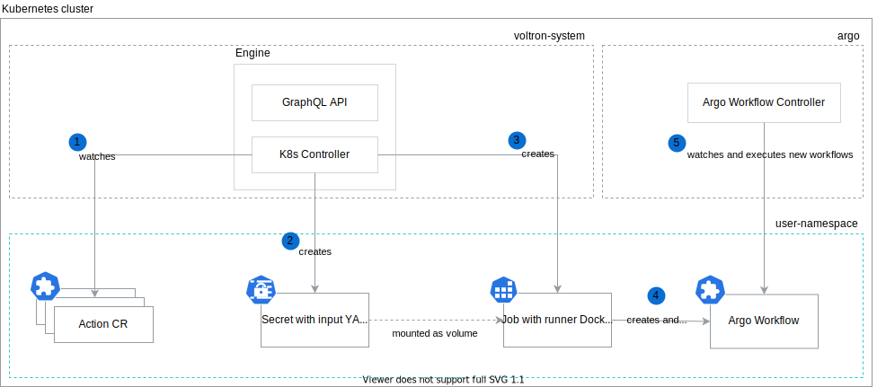

#  Runner

Runners, such as Argo Workflow Runner, Helm Runner, etc., are responsible for running a given Action. The [runner](./../pkg/runner/) package provides Manager, which holds the general logic and allows execution of all runners in the same fashion. This way, each runner implementation holds only business-specific logic.

## Architecture



1. The Voltron Engine watches the Action custom resources. Once the Action is rendered and a user approved it, Engine executes it.

1. The Voltron Engine creates a Kubernetes Secret with the [input data](#input-data).

1. The Voltron Engine creates a Kubernetes Job with the Argo Workflow Runner, and mounts the Secret from the 2nd step as the volume.    

1. The Argo Workflow Runner reads the input data from the filesystem and based on it creates the Argo Workflow custom resource.

1. The Argo Workflow Controller watches Argo Workflows and executes them in a given Namespace. As a result, the actual Action is executed, e.g. Jira installation, cluster benchmarks, etc. 

###  Input data

Each runner must consume the following environment variables:

| Environment Variable Name | Description                                                                                                                          |
|---------------------------|--------------------------------------------------------------------------------------------------------------------------------------|
| **RUNNER_INPUT_PATH**     | Specifies the input path for the file which holds the context and rendered data from the Implementation `spec.action.args` property. |

Input file syntax:

```yaml
context:
    name: "action-name"          # Specifies Action name. The runner should use this name to correlate the resource it creates.
    dryRun: true                 # Specifies whether Action Runner should perform only dry-run action without persisting the resource.
    timeout: "10m"               # Specifies the runner timeout when waiting for competition. The zero value means no timeout.
    platform:                    # Specifies platform-specific values. Currently, only the Kubernetes platform is supported.
      # Kubernetes platform context properties:
      namespace: "k8s-ns-name"      # Specifies the Kubernetes Namespace where Action is executed. The runner must create all Kubernetes resources in this Namespace.
      serviceAccountName: "sa-name" # Specifies the Kubernetes ServiceAccount. The runner must use it to create all Kubernetes resources.        
      ownerRef: # Specifies owner reference details (Action Custom Resource controller)
        apiVersion: core.projectvoltron.dev/v1alpha1 # Specifies the owner resource apiVersion
        kind: Action # Specifies the owner resource kind
        blockOwnerDeletion: true # The owner cannot be deleted before the referenced object
        controller: true # Specifies whether the reference points to the managing controller
        name: action-name # Specifies the name of the Action Custom Resource
        uid: 3826a747-cfac-49c7-a81e-1d48cc23096f # Specifies the UID of the Action Custom Resource
args:
    # Rendered data data from the Implementation `spec.action.args` property.
```

The runner must read input file from the `RUNNER_INPUT_PATH` location.

To simplify the development process, we provide Manager, which handles reading the data from disk. All available data is passed for each method execution.

## Development 

Read this section to learn how to develop a new runner.

###  Add a runner implementation

Add a new runner under the `pkg/runner/{name}` directory, and implement the [Runner](./../pkg/runner/api.go) interface:

```go
type Runner interface {
	Start(ctx context.Context, in StartInput) (*StartOutput, error)
	WaitForCompletion(ctx context.Context, in WaitForCompletionInput) (*WaitForCompletionOutput, error)
	Name() string
}
```

This allows you to focus on implementing only a business logic related to the new runner.

Optionally you can implement `LoggerInjector` interface. If implemented method is detected, Manager injects [zap](https://github.com/uber-go/zap) logger before executing any other methods on runner.

```go
// LoggerInjector is used by the Manager to inject logger to Runner.
type LoggerInjector interface {
	InjectLogger(*zap.Logger)
}
```

###  Create binary

A new runner can be added under the [cmd](../cmd) package.

```go
func main() {
	// Create your runner
	argoRunner := argo.NewRunner()

	// Create status reporter.
	// It is Engine specific implementation that allows Manager
	// report status in a way that Engine knows how to consume it.
	// For non-built-in runners use NOP status reporter.
	statusReporter := statusreporter.NewK8sConfigMap()

	// Create and run Manager.
	mgr, err := runner.NewManager(argoRunner, statusReporter)
	exitOnError(err)

	err = mgr.Execute(stop)
	exitOnError(err)
}
```

Use the following environment variables to configure the Manager:

| Environment Variable Name  | Description                                                                                                                           |
|----------------------------|---------------------------------------------------------------------------------------------------------------------------------------|
| **RUNNER_LOGGER_DEV_MODE** | Specifies whether to use the development logger that writes `DebugLevel` and above logs to standard error in a human-friendly format. |

##  Available runners

###  Argo Workflow Runner

The Argo Workflow Runner implementation is defined in the [pkg/runner/argo](../pkg/runner/argo) package. It creates the Argo Workflow CR and waits for completion using the Kubernetes *watch* functionality. It exits with error when the Argo Workflow with the `context.name` name already exists. Argo Workflow ServiceAccount is always overridden with the one provided via the `context.platform.serviceAccountName` property in the input file.

The implemented dry run functionality only executes the Argo Workflow manifest static validation, and sends a request to the server with the `dry-run` flag, which renders the manifest with the server's representation without creating it.

The Argo Workflow Runner is published to the [gcr.io/projectvoltron/argo-runner](gcr.io/projectvoltron/argo-runner) registry.

> **CAUTION:** As the Argo Workflow does not get created, the nested Action Runners are not executed with the `dry-run` flag.
