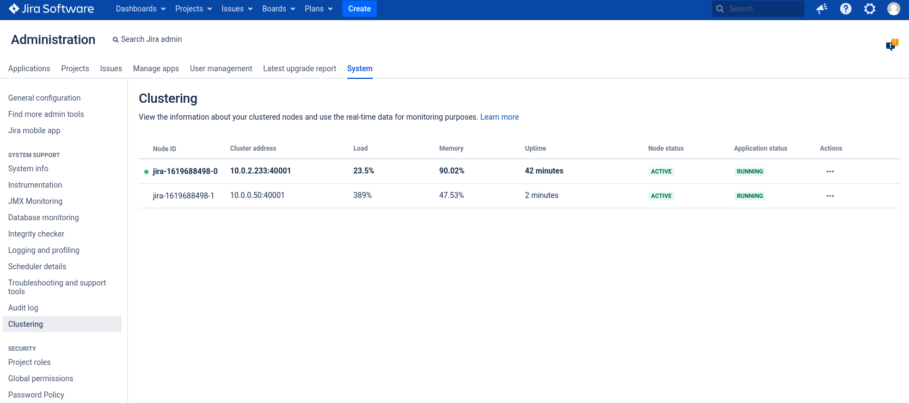

# 3. Provision Jira

To create Jira, follow the steps:

1. Set the Jira license key, domain name under which Jira should be available and RDS TypeInstance ID enviornment variables:
  ```bash
  export JIRA_LICENSE_KEY="<your-jira-license-key>"
  export JIRA_DOMAIN_NAME="<your-jira-domain-name>"
  export POSTGRESQL_TI="<postgresql-ti-from-rds-provisioning>"
  ```

1. Create file with parameters:
  ```bash
  cat > /tmp/jira-params.yaml << ENDOFFILE
  replicaCount: 1
  ingress:
    host: "${JIRA_DOMAIN_NAME}"
  volumes:
    sharedHome:
      persistentVolumeClaim:
        storageClassName: efs-sc
  resources:
    jvm:
      maxHeap: 2g
      minHeap: 512m
  jira:
    licenseKeyInBase64: "${JIRA_LICENSE_KEY}"
  ENDOFFILE
  ```

1. Create file with TypeInstance input:
  ```bash
  cat > /tmp/jira-tis.yaml << ENDOFFILE
  typeInstances:
    - name: "postgresql"
      id: "${POSTGRESQL_TI}"
  ENDOFFILE
  ```

1. Create a Kubernetes namespace for Jira:
  ```bash
  kubectl create namespace jira
  ```

2. Create Action:
  ```bash
  capact act create cap.interface.productivity.jira.install --name jira --namespace jira --parameters-from-file /tmp/jira-params.yaml --type-instances-from-file /tmp/jira-tis.yaml
  ```

1. Run Action:
  ```bash
  capact act run jira --namespace jira
  ```

1. Watch Action:
  ```bash
  capact act watch jira --namespace jira
  ```

1. Once the Action is succeeded, open Jira in your browser. It should be available under the ${JIRA_DOMAIN_NAME} you provided.
 
1. Setup the Jira installation. This can take a few minutes. If you get an `503 Service Unavailable` error, refresh the page and continue.

1. (Optional) After Jira is configured and you are able to login, you can scale out the Jira StatefulSet:
  ```bash
  kubectl -n jira scale  statefulsets.apps -l app.kubernetes.io/name=jira --replicas 2
  ```

  After a few minutes you should be see the second node appear on `Jira Administration -> System -> Clustering` page.

  
  