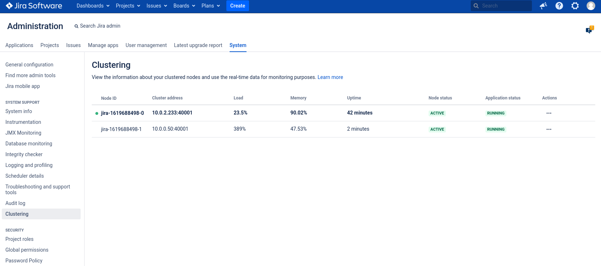

# 5. Install Jira

Follow these steps to install Atlassian Jira using existing PostgreSQL installation.

1. Save your Jira license in the `license.txt` file.

    >**NOTE:** You can generate a trial license from the [Atlassian Website](https://my.atlassian.com/license/evaluation).

1. Set the Jira license key, domain name under which Jira should be available and PostgresSQL AWS RDS TypeInstance ID environment variables:

    >**NOTE**: Use the PostgreSQL TypeInstance ID from the [Provision AWS RDS for PostgreSQL](./2-aws-rds-provisioning.md) tutorial.

    ```bash
    export LICENSE_KEY_BASE64=$(/bin/cat license.txt | base64 )
    export CAPACT_DOMAIN_NAME="{domain-name}" # e.g. demo.cluster.capact.dev
    export POSTGRESQL_TI_ID="{ti-id}"
    ```
    
2. Create a file with parameters:
    ```bash
    cat > /tmp/jira-params.yaml << ENDOFFILE
    replicaCount: 1
    ingress:
      host: "jira.${CAPACT_DOMAIN_NAME}"
    volumes:
      sharedHome:
        persistentVolumeClaim:
          storageClassName: efs-sc
          resources:
            requests:
              storage: 25Gi
      localHome:
        persistentVolumeClaim:
          resources:
            requests:
              storage: 25Gi
    resources:
      jvm:
        maxHeap: 2g
        minHeap: 512m
    jira:
      licenseKeyInBase64: "${LICENSE_KEY_BASE64}"
    ENDOFFILE
    ```

> **NOTE:** It is recommended to start with a single Jira replica before finishing the configuration process.

1. Create file a with TypeInstance input:
    ```bash
    cat > /tmp/jira-ti.yaml << ENDOFFILE
    typeInstances:
      - name: "postgresql"
        id: "${POSTGRESQL_TI_ID}"
    ENDOFFILE
    ```

1. Create a Kubernetes Namespace for Jira:
    ```bash
    kubectl create namespace jira
    ```

1. Create an Action:
    ```bash
    capact act create cap.interface.productivity.jira.install --name jira --namespace jira --parameters-from-file /tmp/jira-params.yaml --type-instances-from-file /tmp/jira-ti.yaml
    ```

1. Run the Action:
    ```bash
    capact act run jira --namespace jira
    ```

1. Watch the Action:
    ```bash
    capact act watch jira --namespace jira
    ```

1. Once the Action succeeded, open Jira in your browser. It should be available under `https://jira.${CAPACT_DOMAIN_NAME}`.
 
1. Setup the Jira installation. This can take a few minutes. If you get an `503 Service Unavailable` error, refresh the page and continue.

1. (Optional) After Jira is configured and you are able to login, you can scale out the Jira StatefulSet:
    
    ```bash
    kubectl -n jira scale statefulsets.apps -l app.kubernetes.io/name=jira --replicas 2
    ```

    After a few minutes, the second node should appear on the `Jira Administration -> System -> Clustering` page.

    
  
  **Next steps:** Navigate back to the [main README](./README.md) and follow next steps.
