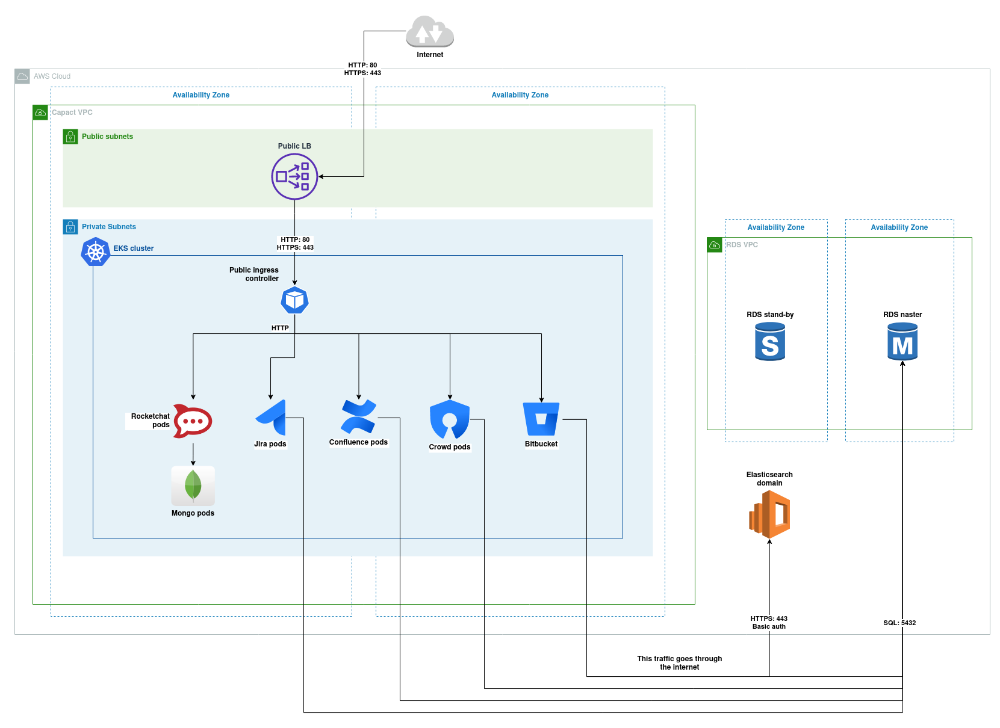

# Atlassian stack installation

This tutorial showcases how to install Atlassian stack on AWS EKS cluster with single AWS RDS instance.

## Prerequisites

- AWS account with **AdministratorAccess** permissions
- Capact cluster provisioned using [EKS Installation tutorial](../eks-installation/README.md)

## Steps

1. [Configure Cluster Policy to prefer AWS solutions](./1-cluster-policy-configuration.md)
1. [Provision AWS RDS for PostgreSQL](./2-aws-rds-provisioning.md)
