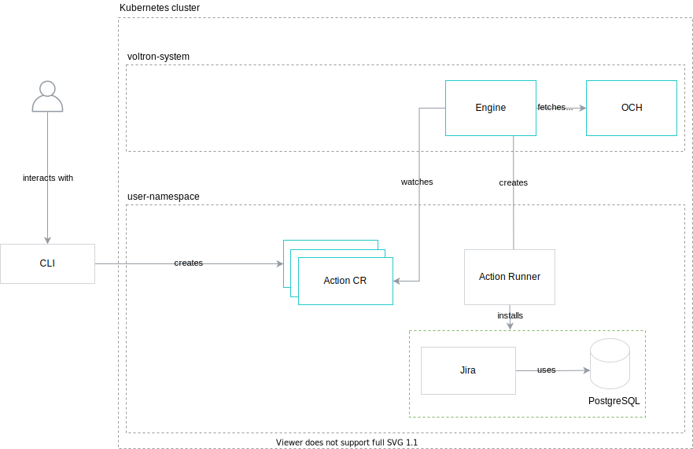

# Jira installation

This tutorial shows the basic concepts of Voltron on the Jira installation example.

###  Table of Contents

<!-- toc -->

- [Goal](#goal)
- [Prerequisites](#prerequisites)
- [Install all Jira components in a Kubernetes cluster](#install-all-jira-components-in-a-kubernetes-cluster)
  * [Instructions](#instructions)
  * [Clean-up](#clean-up)
- [Install Jira with an external CloudSQL database](#install-jira-with-an-external-cloudsql-database)
  * [Instructions](#instructions-1)
  * [Clean-up](#clean-up-1)
- [Behind the scenes](#behind-the-scenes)
  * [OCF manifests](#ocf-manifests)
  * [Content development](#content-development)
- [Additional resources](#additional-resources)

<!-- tocstop -->

### Goal

This instruction will guide you through the installation of Jira on a Kubernetes cluster using Voltron. 

Jira depends on the PostgreSQL database. Depending on the cluster configuration, with the Voltron project, you can install Jira with a managed Cloud SQL database or a locally deployed PostgreSQL Helm chart.

The diagrams below show possible scenarios:

**Install all Jira components in a Kubernetes cluster**



**Install Jira with an external Cloud SQL database**


###  Prerequisites

* [`ocftool`](https://github.com/Project-Voltron/go-voltron/releases/tag/v0.1.0) installed.
* [`kubectl`](https://kubernetes.io/docs/tasks/tools/install-kubectl/) installed.
* GKE cluster with a fresh Voltron installation. See the [installation tutorial](../voltron-installation/README.md). 
* For the scenario with Cloud SQL, Access to Google Cloud Platform.  

### Install all Jira components in a Kubernetes cluster

By default, the Voltron Engine [cluster policy](../../../deploy/kubernetes/charts/voltron/charts/engine/values.yaml) prefers Kubernetes solutions. 

```yaml
apiVersion: 0.1.0 # Defines syntax version for policy

rules: # Configures the following behavior for Engine during rendering Action
  cap.*:
    oneOf:
      - implementationConstraints: # prefer Implementation for Kubernetes
          requires:
            - path: "cap.core.type.platform.kubernetes"
              # any revision
      - implementationConstraints: {} # fallback to any Implementation
```

As a result, all external solutions, such as Cloud SQL, have a lower priority, and they are not selected. The below scenario shows how to install Jira with a locally deployed PostgreSQL Helm chart.

#### Instructions

1. Create a Kubernetes Namespace:

	```bash
    export NAMESPACE=local-scenario
	kubectl create namespace $NAMESPACE
	```
 
1. Open the GraphQL console:

    To obtain the Gateway URL and authorization information, run:
    
    ```bash
    helm get notes -n voltron-system voltron    
    ```
   
   Navigate to the GraphQL console and add the required `Authorization` header based on the received response.
   
   

1. List all `cap.interface.productivity.*` Interfaces:

	<details><summary>Query</summary>

	```graphql
    query GetInterfaces {
      interfaces(filter: { pathPattern: "cap.interface.productivity.*" }) {
        path
        revisions {
          metadata {
            path
            displayName
          }
          revision
        }
      }
    }
	```

	</details>

	

	The response on the right-hand side represents all available Actions that you can execute for the **productivity** category. As you can see, you can install instances of Jira and Confluence. For manifests, there might be more revisions. Different revisions mean that the installation input/output parameters differ. It might be due to a new feature or one removed in a non-backward-compatible way.


1. Create an Action with the `cap.interface.productivity.jira.install` Interface:

	Before running the GraphQL mutation, you must add the `Namespace` header in the **HTTP HEADERS** section.

    <details><summary>Headers</summary>
	
	```json
	{
	 "Authorization": "....",
	 "Namespace": "local-scenario"
	}
	```
 
    </details>
    
    Additionally, you must change the **host** value in input parameters.
 	
	<details><summary>Mutation</summary>

	```graphql
    mutation CreateAction {
      createAction(
        in: {
          name: "jira-instance"
          actionRef: { path: "cap.interface.productivity.jira.install" }
          input: {
            parameters: "{ \"host\": \"{REPLACE_WITH_HOST_NAME}\" }"
          }
        }
      ) {
        name
        createdAt
        renderedAction
        run
        status {
          phase
          timestamp
          message
          runner {
            status
          }
        }
      }
    }
	```

	</details>

	

1. Get the status of the Action from the previous step:

	<details><summary>Query</summary>

	```graphql
	query GetAction {
	  action(name: "jira-instance") {
	    name
	    createdAt
	    renderedAction
	    run
	    status {
	      phase
	      timestamp
	      message
	      runner {
	        status
	      }
	    }
	  }
	}
	```

	</details>

	

	In the previous step, when you created the Action, you saw the phase `INITIAL` in the response. Now the Action is in `READY_TO_RUN`. It means that the Action was processed by the Engine, and the Interface was resolved to a specific Implementation. As a user, you can verify that the rendered Action is what you expected. If the rendering is taking more time, you will see the `BEING_RENDERED` phase.

1. Run the rendered Action:

	In the previous step, the Action was in the `READY_TO_RUN` phase. It is not executed automatically, as the Engine waits for the user's approval. To execute it, you need to send a `runAction` mutation:

	<details><summary>Mutation</summary>

	```graphql
	mutation RunAction {
	  runAction(name: "jira-instance") {
	    name
	    createdAt
	    run
	  }
	}
	```

	</details>

	

1. Check the Action execution:
    
    **Using [Argo CLI](https://github.com/argoproj/argo-workflows/releases/tag/v2.12.8)**
    
    ```bash
    argo watch jira-instance -n $NAMESPACE
    ```
    
    **Using Argo UI**
    
    By default, the Argo UI doesn't have a dedicated Ingress. You need to port-forward the Service to your local machine: 
    
    ```bash
    kubectl -n argo port-forward svc/argo-server 2746
    ```
   
    Navigate to [http://localhost:2746](http://localhost:2746) to open Argo UI, and check the currently running `jira-install` workflow.

1. Wait until the Action is in the phase `SUCCEEDED`:

	<details><summary>Query</summary>

	```graphql
	query GetAction {
	  action(name: "jira-instance") {
	    name
	    createdAt
	    renderedAction
	    run
	    status {
	      phase
	      timestamp
	      message
	      runner {
	        status
	      }
	    }
	  }
	}
	```

	</details>

1. Get the Argo Workflow logs to check the uploaded TypeInstance ID: 
    
    **Using Argo CLI**
    
    ```bash
    argo logs jira-instance -n $NAMESPACE | grep -e 'upload_type_instances*'
    ```

    **Using Argo UI**
    
    From the **Workflows** view, select `jira-instance`. Next, select the last step called `upload-output-type-instances-step` and get its logs. The logs contain the uploaded TypeInstance ID.

	

1. Get the TypeInstance details: 

    Use the ID from the previous step and fetch the TypeInstance details.

	<details><summary>Query</summary>

	```graphql
    query GetTypeInstance {
      typeInstance(id: "{JIRA_CONFIG_ID}") {
        typeRef {
          path
        }
        latestResourceVersion {
          spec {
            value
          }
        }
      }
    }
	```

	</details>

	

1. Open the Jira console using the **host** value from the previous step.

    

🎉 Hooray! You now have your own Jira instance installed. Be productive!

#### Clean-up 

>⚠️ **CAUTION:** This removes all resources that you created.

When you are done, remove the Action and Helm charts:

```bash
kubectl delete action jira-instance -n $NAMESPACE
helm delete -n $NAMESPACE $(helm list -f="jira-software-*|postgresql-*" -q -n $NAMESPACE)
```

### Install Jira with an external CloudSQL database

To change the Jira installation, we need to adjust our cluster policy to prefer GCP solutions. Read more about policy configuration [here](../../policy-configuration.md).

#### Instructions

1. Create a GCP Service Account JSON access key:
   
   	1. Open [https://console.cloud.google.com](https://console.cloud.google.com) and select your project.
   
   	2. In the left pane, go to **IAM & Admin** and select **Service accounts**.
   
   	3. Click **Create service account**, name your account, and click **Create**.
   
   	4. Assign the `Cloud SQL Admin` role.
   
   	5. Click **Create key** and choose `JSON` as the key type.
   
   	6. Save the `JSON` file.
   
   	7. Click **Done**.


1. Convert the GCP Service Account JSON to the JavaScript format:

   ```bash
   cat {PATH_TO_GCP_SA_FILE} | sed -E 's/(^ *)"([^"]*)":/\1\2:/'
   ```

1. Create a TypeInstance with the GCP Service Account:

   	Before running the GraphQL mutation, you must replace the **value** parameter with the output from the previous step. 
   
    ```graphql
    mutation CreateTypeInstance {
      createTypeInstance(
        in: {
          typeRef: { path: "cap.type.gcp.auth.service-account", revision: "0.1.0" },
          attributes: [
            { path: "cap.attribute.cloud.provider.gcp", revision: "0.1.0" }
          ],
          value: {} # Replace the empty object with SA in the JS format
        }
      ) {
        id
        typeRef {
          path
          revision
        }
      }
    }
    ```

1. Export the TypeInstance UUID:

   The response from the previous step contains the TypeInstance ID. Export it as environment variable:
   
   ```bash
   export TI_ID={TYPE_INSTANCE_ID}
   ```

1. Create a file with the new cluster policy:

   ```yaml
   cat > /tmp/policy.yaml << ENDOFFILE
   apiVersion: 0.1.0
   rules:
     cap.interface.database.postgresql.install:
      oneOf:
        - implementationConstraints:
            attributes:
              - path: "cap.attribute.cloud.provider.gcp"
            requires:
              - path: "cap.type.gcp.auth.service-account"
          injectTypeInstances:
            - id: ${TI_ID}
              typeRef:
                path: "cap.type.gcp.auth.service-account"
                revision: "0.1.0"
     cap.*:
       oneOf:
         - implementationConstraints:
             requires:
               - path: "cap.core.type.platform.kubernetes"
         - implementationConstraints: {} # fallback to any Implementation
   ENDOFFILE
   ```
   
   >**NOTE**: If you are not familiar with the syntax above, check the [policy configuration document](../../policy-configuration.md).  

1. Update the cluster policy ConfigMap:

   ```bash
   kubectl create configmap -n voltron-system voltron-engine-cluster-policy --from-file=cluster-policy.yaml=/tmp/policy.yaml -o yaml --dry-run=client | kubectl apply -f -
   ``` 

1. Create a Kubernetes Namespace:

	```bash
    export NAMESPACE=gcp-scenario
	kubectl create namespace $NAMESPACE
	```

1. Install Jira with the new cluster policy:

   The cluster policy was updated to prefer GCP solutions for the PostgreSQL Interface. As a result, during the render process, the Voltron Engine will select a Cloud SQL Implementation which is available in our OCH server.
   
   Repeat the steps from [Install all Jira components in a Kubernetes cluster](#install-all-jira-components-in-a-kubernetes-cluster) in the `gcp-scenario` Namespace. Start with the 4th step, and remember to update the Namespace value in the GraphQL **HTTP HEADERS** section.

🎉 Hooray! You now have your own Jira instance installed. Be productive!

#### Clean-up

>⚠️ **CAUTION:** This removes all resources that you created.

When you are done, remove the Cloud SQL manually and delete the Action:

```bash
kubectl delete action jira-instance -n $NAMESPACE
```

### Behind the scenes

The following section extends the tutorial with additional topics, to let you dive even deeper into the Voltron concepts.

#### OCF manifests

A user consumes content stored in Open Capability Hub (OCH). The content is defined using Open Capability Format (OCF) manifests. The OCF specification defines the shape of manifests that Voltron understands, such as Interface or Implementation.

To see all the manifest that OCH stores, navigate to the [OCH content structure](../../../och-content).

To see the Jira installation manifests, click on the following links:
 - [Jira installation Interface](../../../och-content/interface/productivity/jira/install.yaml) - a generic description of Jira installation (action name, input, and output - a concept similar to interfaces in programming languages),
 - [Jira installation Implementation](../../../och-content/implementation/atlassian/jira/install.yaml) - represents the dynamic workflow for Jira Installation.

#### Content development

To make it easier to develop new OCH content, we implemented a dedicated CLI. Currently, it exposes the validation feature for OCF manifests. It detects the manifest kind and the OCF version to properly validate a given file. You can use it to validate one or multiple files at a single run.

To validate all OCH manifests, navigate to the repository root directory and run the following command:

```bash
ocftool validate ./och-content/**/*.yaml
```

In the future, we plan to extend the `ocftool` with additional features, such as:
- manifests scaffolding,
- manifests submission,
- signing manifests.

###  Additional resources

If you want to learn more about the project, check the [`go-voltron`](https://github.com/Project-Voltron/go-voltron) repository.

Here are some useful links:

- [Tutorial which shows the first steps on how to develop OCF content for Voltron.](../content-creation/README.md)
- The [OCF Draft v0.0.1](https://docs.google.com/document/d/1ud7xL3bXxEXtVPE8daA_DHYacKHMkn_jx6s7eaVT-NA/edit?usp=drive_web&ouid=115672498843496061020) document. 
- [Documentation](../../../docs), which contains various investigations, enhancement proposals, tutorials, Voltron architecture and development guideline.
- Google Drive folder with the [initial draft concepts](https://drive.google.com/drive/u/1/folders/1SBpIR0QUn9Rp68w6N3G-hqXdi1HfZQsn).
