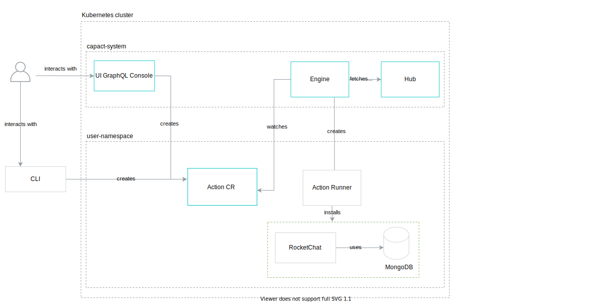
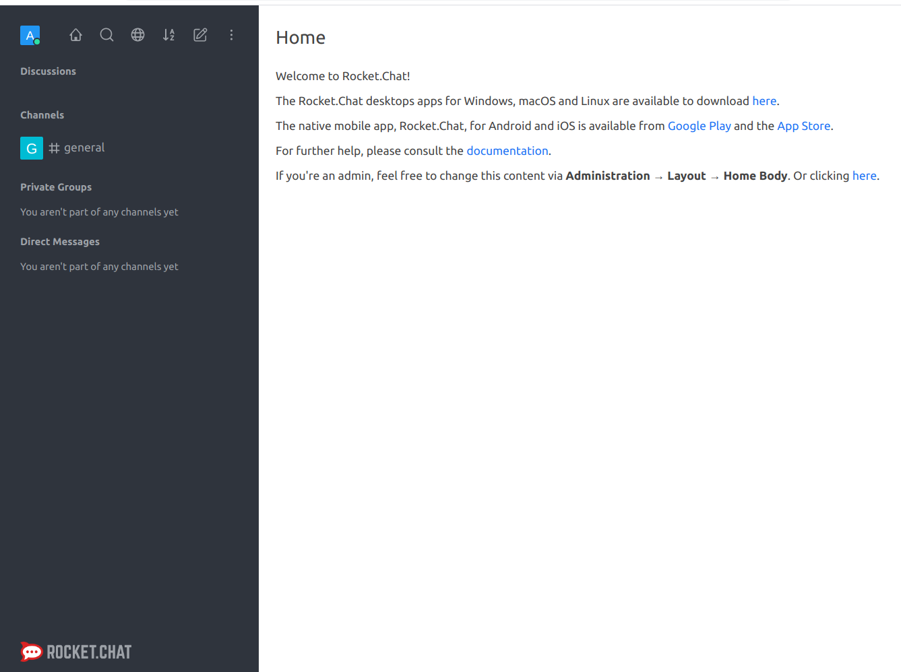
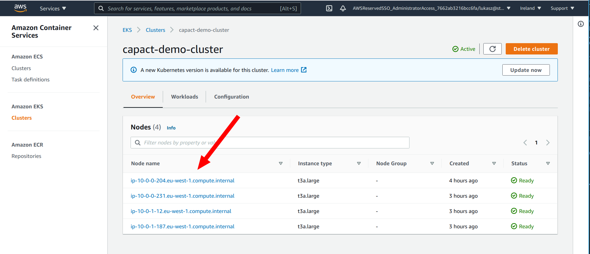
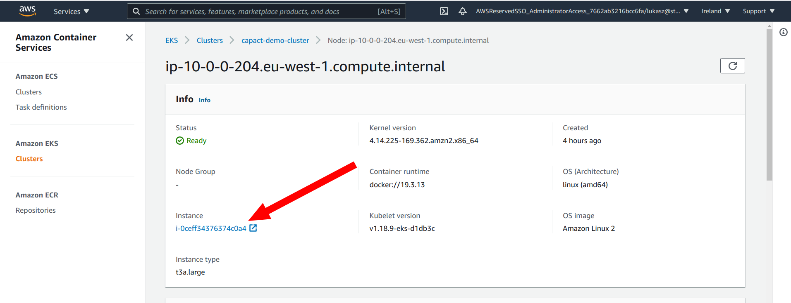
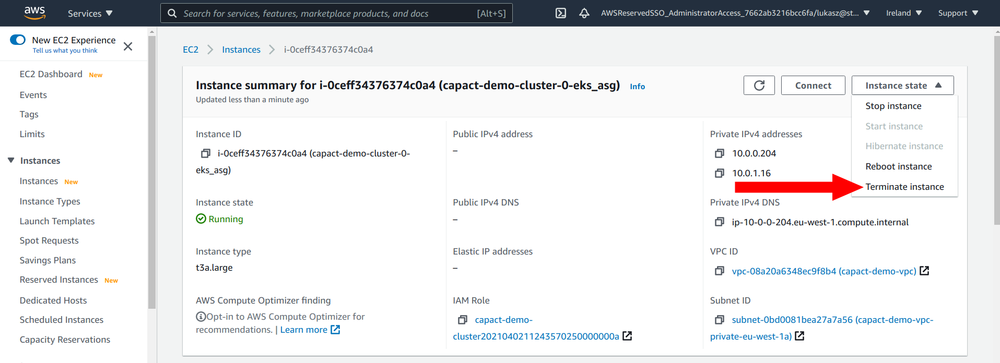

# RocketChat installation

This tutorial shows the basic concepts of Voltron on the RocketChat installation example.

###  Table of Contents

<!-- toc -->

- [Goal](#goal)
- [Prerequisites](#prerequisites)
- [Install all RocketChat components in a Kubernetes cluster](#install-all-rocketchat-components-in-a-kubernetes-cluster)
- [Validate RocketChat high availability setup](#validate-rocketchat-high-availability-setup)
- [Clean-up](#clean-up)
- [Additional resources](#additional-resources)

<!-- tocstop -->

### Goal

This instruction will guide you through the installation of RocketChat on a Kubernetes cluster using Voltron. 

RocketChat depends on the MongoDB database.

The diagram below shows the scenario:



###  Prerequisites

* Voltron cluster installed, for example on [AWS EKS](../eks-installation/README.md).See also [GCP cluster installation guide](../voltron-installation/README.md).

> **NOTE:** For AWS EKS Voltron installation, all operation need to be run from the bastion host.

The following tools are required:

* capectl installed

  To build it, install Go and run:

  ```bash
  GOOS=linux GOARCH=amd64 go build -ldflags "-s -w" -o capectl ./cmd/ocftool/main.go
  ```

* [`kubectl`](https://kubernetes.io/docs/tasks/tools/install-kubectl/) installed.
* [`helm`](https://helm.sh/docs/intro/install/) installed.
* [`jq`](https://stedolan.github.io/jq/) installed.

### Install all RocketChat components in a Kubernetes cluster


1. Setup capectl

    To obtain the Gateway URL and password run:
    
    ```bash
    HOST=`kubectl -n voltron-system get ingress voltron-gateway -o go-template --template="{{ (index .spec.rules 0).host }}"`
    PASSWORD=`helm -n voltron-system get values voltron --all -o json | jq .global.gateway.auth.password -r`
    ```

    then configure `capectl`

    ```bash
    capectl login "https://${HOST}" -u graphql -p ${PASSWORD}
    capectl config set-context https://${HOST}
    ```

1. Make sure to separate workloads

   For a better performance and durability, it is recommended to run MongoDB and RocketChat on separate nodes. MongoDB is by default configured to prefer being run on nodes with label `node.voltron.dev/type=storage`. We will also configure RocketChat affinity to not schedule pods on such nodes.

   Select any worker node and replace the `<NODE NAME>` with the node name and run:

   ```bash
   kubectl label node <NODE NAME> node.voltron.dev/type=storage
   ```
   
1. Create an Action with the `cap.interface.productivity.rocketchat.install` interface:

    Open interactive actions browser, and type there `rocket` to find correct action.

    ```bash
    capectl hub interfaces browse
    ```

    Press enter, this will start a wizard:

    * set the name `rocket`
    * accept `default` namespace
    * type `y` to provide input parameters
    * in the editor provide following data(remember to update a domain)

      ```yaml
      host: chat.demo.capact.dev
      replicas: 3
      affinity:
        nodeAffinity:
          requiredDuringSchedulingIgnoredDuringExecution:
            nodeSelectorTerms:
            - matchExpressions:
              - key: node.voltron.dev/type
                operator: NotIn
                values:
                - storage
      ```
    * type `n` when asked about providing type instances

1. Get the status of the Action from the previous step:

   ```bash
   capectl action get rocket
   ```

   Wait until the Action is in `READY_TO_RUN` state. It means that the Action was processed by the Engine, and the Interface was resolved to a specific Implementation. As a user, you can verify that the rendered Action is what you expected. If the rendering is taking more time, you will see the `BEING_RENDERED` phase.

1. Run the rendered Action:

   In the previous step, the Action was in the `READY_TO_RUN` phase. It is not executed automatically, as the Engine waits for the user's approval. To execute it, you need to run the action:

   ```bash
   capectl action run rocket
   ```

1. Check the Action execution:
    
   ```bash
   capectl action watch rocket
   ```

   Wait until the Action is finished.

1. Open the RocketChat UI using the **host** value from the previous step.

    

🎉 Hooray! You now have your own RocketChat instance installed. Be productive!

### Validate RocketChat high availability setup

> **NOTE**: The following steps are optional. In this tutorial we used AWS EKS Voltron installation and all instructions will be based on this setup.

Now, let's validate the high-availability setup for the RocketChat.

#### Non disruptive tests

Here we are simulating maintenance actions which should not disrupt RocketChat. Non disruptive actions for example are:

* Rolling update of RocketChat.
* Scheduled Node maintenance where pods are evicted from the node.
* Rescheduling pod to another node.

1. List RocketChat pods

   ```bash
   kubectl get pod -l app.kubernetes.io/name=rocketchat
   ```

1. Select two random pods from the list above and delete them.

  Use `kubectl delete` command. For example:
  
  ```bash
   kubectl delete pod rocketchat-1617956008-rocketchat-5b45b74f77-pncck
   ```

   > **NOTE:** Make sure that at least one pod is in *Ready* state.

1. Verify if RocketChat is still running without any disruption.

#### Disruptive tests

Here we are simulating scenario when Kubernetes lost a connection to one of the worker nodes.

1. Make sure that MongoDB and RocketChat pods are running on different nodes.

   To list pods and assigned nodes run:

   ```bash
   kubectl get pod -o wide
   ```

1. Make sure that the pod running in the `public-ingress-nginx` namespace is not running on the same nodes as RocketChat.

   ```bash
   kubectl -n public-ingress-nginx get pod -o wide
   ```

1. Get a list of nodes where RocketChat pods are running:

   ```bash
   kubectl get pod -o go-template --template='{{ range .items}}{{.metadata.name}} - {{ .spec.nodeName }}{{"\n"}}{{end}}'
   ```

    Choose one of them and note the node name.

1. Terminate the selected worker node from the EKS console.

   To terminate note go to the cluster main page. In the *Overview* section click on the selected node. In the **Info** section click a link under **Instance** name. New tab will be opened. From the menu in the top right select **Terminate instance** option

   
   
   
   
1.  Open the RocketChat site again using provided host during RocketChat installation. It should be still accessible.

    > **NOTE**: Depending on which node will be deleted and to which RocketChat Pod you are connected, it may take up to 30 seconds for Kubernetes to change configuration. During that time RocketChat may not be available.


### Clean-up 

>⚠️ **CAUTION:** This removes all resources that you created.

When you are done, remove the Action and Helm charts:

```bash
capectl action delete rocket
helm delete $(helm list -f="rocketchat-*|mongodb-*" -q
```

###  Additional resources

If you want to learn more about the project, check the [`go-voltron`](https://github.com/Project-Voltron/go-voltron) repository.

Here are some useful links:

- [Tutorial which shows the first steps on how to develop OCF content for Voltron.](../content-creation/README.md)
- [Documentation](../../../docs), which contains various investigations, enhancement proposals, tutorials, Voltron architecture and development guideline.
