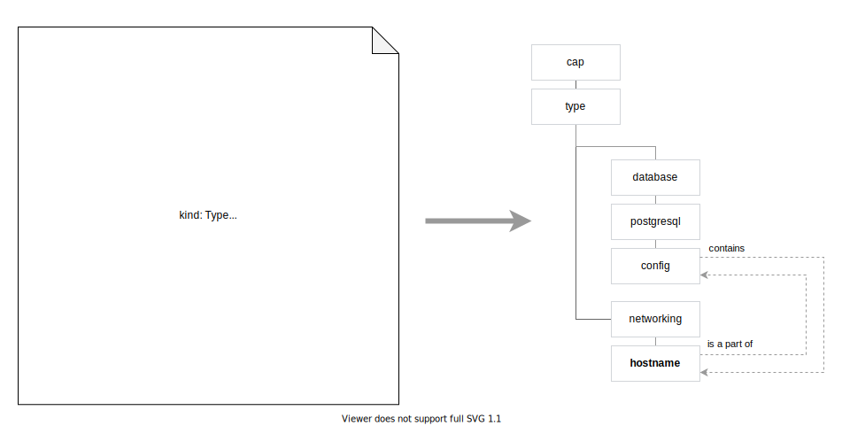

# Type features

The following document describes Type entity features.

## Table of contents

<!-- toc -->

- [Additional references to parent nodes](#additional-references-to-parent-nodes)
  * [Find Types based on prefix of parent nodes](#find-types-based-on-prefix-of-parent-nodes)
  * [The `requires` section in Implementation manifest](#the-requires-section-in-implementation-manifest)
- [Type composition](#type-composition)

<!-- tocstop -->

## Additional references to parent nodes

> **NOTE** This feature is also available for Attribute.

Type can contain additional references to other parent nodes. The connection means that the Type becomes a child of the referenced parent nodes. In a result, the Type has multiple parents.


Currently, the feature brings the following benefits:
- **GraphQL API:** it allows User to find related Types based on a prefix of the parent node.
- **Implementation manifest:** the `requires` block in Implementation manifest can refer to Types, which has additional references to parent node

### Find Types based on prefix of parent nodes

1. `cap.type.platform.cloud-foundry` references `cap.core.type.platform` empty node:

   ```yaml
   # Type manifest
   kind: Type
   metadata:
      name: cloud-foundry
      # (...)
   spec:
      additionalRefs:
         - cap.core.type.platform
   # (...)
   ```

1. User queries OCH with CLI for all Types with prefix `cap.core.type.platform.*`.
1. The CLI returns the following output:

   ```yaml
   - name: "cap.core.type.platform.kubernetes"
   - name: "cap.type.platform.cloud-foundry"
   ```

### The `requires` section in Implementation manifest

Type `cap.type.platform.cloud-foundry` can specify additional reference to `cap.core.type.platform `empty node.

```yaml
# Type manifest
kind: Type
metadata:
   name: cloud-foundry
   # (...)
spec:
   additionalRefs:
      - cap.core.type.platform
# (...)
```

In that way, the Type `cap.type.platform.cloud-foundry` can be used in the context of any Type with prefix `cap.type.platform.*`, such as `requires` block:

```yaml
# Implementation manifest
# (...)
spec:
   # (...)
   requires:
    cap.core.type.platform:
      oneOf:
        - name: kubernetes
          revision: 0.1.0
        - name: cap.type.platform.cloud-foundry
          revision: 0.1.1
```

## Type composition

> **NOTE** This feature is currently not available, but is planned for future Voltron release.

Type entities can be defined in a form of composition of other Types. It gives you an ability to define common Type definitions once and reuse them later.

To enable Content Creator to compose Types in JSON schema, we use, among other things, [built-in JSON Schema combining functionality](http://json-schema.org/understanding-json-schema/reference/combining.html) . Every time we see a reference to external JSON schema, we fetch the type and embed its schema.

Once Content Creator submits a new Type and there is a reference to other Type, we create edges in the OCH for every single Type reference. It enables us to easily find Types, which are derived from original Types.



This feature allows User to run generic Actions against different TypeInstances. For example, there could be an Action that takes IP Addresses as input. Thanks to the Type composition, User will be able to use the IP Addresses, which are nested in other TypeInstances.
