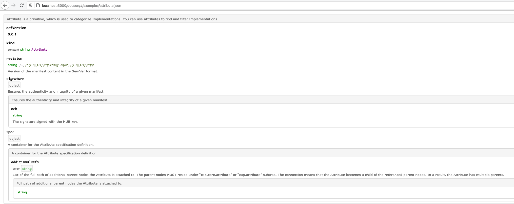

# JSONSchema 2 Markdown generator test

### Adobe `jsonschema2md`

Repo: https://github.com/adobe/jsonschema2md

Example: 
- their: https://github.com/adobe/jsonschema2md/tree/main/examples/docs
- our: [adobe-jsonschema2md](./adobe-jsonschema2md)

Command:

```bash
jsonschema2md -d ocf-spec/0.0.1/schema/ -o ocf-spec/docs/adobe-jsonschema2md --schema-extension=json --example-format=yaml --skip  typesection -n --schema-out=-
```

Issues:
- Generates 60+ files for our schemas, and we are not able to say that each schema should be in a single file via flags/config. As a result, we have files named like `implementation-properties-metadata-allof-1-properties-license-oneof-0-properties-name.md`.
- We need to add title property to our schemas, otherwise it generates is as `Untitled schema`.
- Not all files are generated, but we also do not get any error, e.g. for [interfaces.md](./adobe-jsonschema2md/interface.md) the `interface-properties-spec.md` was not generated. Needs to be investigated further.
- Information duplication, e.g. [atrribute.md](./adobe-jsonschema2md/attribute.md) has full definition for the `ocfVersion` type, but we also have [attribute-properties-ocfversion.md](./adobe-jsonschema2md/attribute-properties-ocfversion.md) which duplicates this information.
- The shared metadata is generated as a single .md file. But others files refer to `attribute-properties-ocf-metadata.md` instead of `metadata.md`. Needs to be investigated further.  

### Wetzel

Repo: https://github.com/CesiumGS/wetzel

Example:
- their: https://github.com/KhronosGroup/glTF/tree/master/specification/2.0#properties-reference
- our: [wetzel](./wetzel)

Command:

```bash
wetzel ocf-spec/0.0.1/schema/attribute.json  -l 2 > ./ocf-spec/docs/wetzel/attribute.md
wetzel ocf-spec/0.0.1/schema/interface.json  -l 2 > ./ocf-spec/docs/wetzel/interface.md
wetzel ocf-spec/0.0.1/schema/interface-group.json  -l 2 > ./ocf-spec/docs/wetzel/interface-group.md
wetzel ocf-spec/0.0.1/schema/repo-metadata.json  -l 2 > ./ocf-spec/docs/wetzel/repo-metadata.md
wetzel ocf-spec/0.0.1/schema/repo-metadata.json  -l 2 > ./ocf-spec/docs/wetzel/repo-metadata.md
wetzel ocf-spec/0.0.1/schema/type.json  -l 2 > ./ocf-spec/docs/wetzel/type.md
wetzel ocf-spec/0.0.1/schema/type.json  -l 2 > ./ocf-spec/docs/wetzel/type.md
wetzel ocf-spec/0.0.1/schema/vendor.json  -l 2 > ./ocf-spec/docs/wetzel/vendor.md

# implementation not supported, error: Error: Unable to find $ref #/definitions/requireEntity
# wetzel ocf-spec/0.0.1/schema/implementation.json  -l 2 > ./ocf-spec/docs/wetzel/implementation.md
```

Issues:
- We need to add title property to our schemas, otherwise it generates is as `WETZEL_WARNING: title not defined.xxx`.
- Supports only local `$ref`. Doesn't support `http` refs, or even definition reference: `Error: Unable to find $ref #/definitions/requireEntity`
- Supports the Draft-4, we use Draft-7.
- Supports single schema at time.

### RalfG `jsonschema2md`

Repo: https://github.com/RalfG/jsonschema2md

Example: 
- their: https://github.com/RalfG/jsonschema2md/tree/master/examples
- our: [ralfg-jsonschema2md](./ralfg-jsonschema2md) 

Command:

```bash
jsonschema2md ocf-spec/0.0.1/schema/attribute.json ./ocf-spec/docs/ralfg-jsonschema2md/attribute.md
jsonschema2md ocf-spec/0.0.1/schema/interface.json ./ocf-spec/docs/ralfg-jsonschema2md/interface.md
jsonschema2md ocf-spec/0.0.1/schema/interface-group.json ./ocf-spec/docs/ralfg-jsonschema2md/interface-group.md
jsonschema2md ocf-spec/0.0.1/schema/repo-metadata.json ./ocf-spec/docs/ralfg-jsonschema2md/repo-metadata.md
jsonschema2md ocf-spec/0.0.1/schema/repo-metadata.json ./ocf-spec/docs/ralfg-jsonschema2md/repo-metadata.md
jsonschema2md ocf-spec/0.0.1/schema/type.json ./ocf-spec/docs/ralfg-jsonschema2md/type.md
jsonschema2md ocf-spec/0.0.1/schema/type.json ./ocf-spec/docs/ralfg-jsonschema2md/type.md
jsonschema2md ocf-spec/0.0.1/schema/vendor.json ./ocf-spec/docs/ralfg-jsonschema2md/vendor.md
jsonschema2md ocf-spec/0.0.1/schema/implementation.json ./ocf-spec/docs/ralfg-jsonschema2md/implementation.md
```

Issues:
- Simple, e.g. doesn't add information is something is required or not.
- Doesn't support inlining the `$ref` definition.
- Supports single schema at time.
- For implementation the `metadata` property was not resolved properly.

### Docson

Repo: https://github.com/lbovet/docson

Example:
- their: https://lbovet.github.io/docson/index.html#/docson/examples/example.json
- our: 

Issues:
- Package was published 3 years ago.
- Doesn't support $ref.
- Support the Draft-4, we use Draft-7.
- Doesn't generate .md files, serve content in browser.
- Doesn't have option to see all exposed schemas. You need to use a single URL per schema.

### json-schema-for-humans

Repo: https://github.com/coveooss/json-schema-for-humans

Example: 
- their: https://coveooss.github.io/json-schema-for-humans/
- our: [json-schema-for-humans](./json-schema-for-humans/schema_doc.html)

Command:

```bash
generate-schema-doc ocf-spec/0.0.1/schema/attribute.json
```

Issues:

- Supports single schema at time.
- Doesn't generate .md files, serve content in browser.
- Doesn't have option to see all exposed schemas. You need to use a single URL per schema.

### json-schema-md-doc

Repo: https://github.com/BrianWendt/json-schema-md-doc

Example: 
- their: https://github.com/BrianWendt/json-schema-md-doc/blob/master/samples/node/schema.md
- own: [json-schema-md-doc](./json-schema-md-doc)

Issues:

- No CLI option.
- Not user-friendly format. 
